, **advisories**# Data Dictionary — Trading Co-Pilot

The authoritative catalog of the platform's **data entities, key fields, and storage**. Begun as a **design-time
model** derived from the [PRD](trading-platform-prd.md) + [ADRs](adr/), it is now **partially implemented** — rows
carry an **Implemented** marker (with the issue) as their entity lands — and the dictionary is kept **in lockstep
with the `MarqSpec.TradingCopilot.Data` entities and `dotnet ef` migrations** (see *Maintenance* below). Companion to [engineering §2](trading-platform-engineering.md) (storage) and the
[architecture](trading-platform-architecture.md).

**Status:** living — implemented rows are marked per entity · **Date:** 2026-07-22, last reconciled 2026-07-25 (gh#233)

## How to read this
- **Storage** column: `REL` relational · `TS` TimescaleDB hypertable (time-series) · `VEC` pgvector.
- **Traces**: the `R-#` / ADR that motivates the entity (one owner per concept — link here, don't re-describe).
- Listed fields are **key / representative**, not exhaustive; exact types firm up with the EF model.

## Conventions
- **Time:** every timestamp is `timestamptz` in **UTC**; session logic converts to CME/CT (R-13). **Trading day**
  vs. **calendar day** are tracked distinctly.
- **Money & prices:** `numeric` / decimal — **never float**. Quantities are contracts (integer) or `numeric`; each
  instrument carries **tick size** + **point value** for P&L math.
- **Identity:** surrogate PK (GUID or `bigint` — *Decide*) plus natural keys where stable.
- **Venue / source tagging (R-17):** instruments, accounts, orders, and fills carry a **venue** (execution) and/or
  **source** (data) tag end-to-end, so cross-source joins stay honest. These columns persist the domain vocabulary
  in `MarqSpec.TradingCopilot.Domain/Venue/` — `VenueId`, `VenueAccountId`, `VenueContractId` (`venue:key`).
- **Mode (R-14):** account / order / trade records carry **practice | live | undeclared** — an identical pipeline, distinguished
  only for safety and display. Persists `TradingMode`. **Mode is declared, not derived** (gh#60): the venue reports
  execution routing, the operator declares what each firm stage *means*, and an unclassified stage persists as
  **`undeclared`**. `TradingModePolicy` refuses a live account outside production and an **undeclared account
  everywhere, production included**.
- **Exclusion & soft-delete (R-15) — three orthogonal flags:** `training_excluded` (drop from the AI learning set),
  `hidden_from_user` (hide from journal / reports), and `deleted` (soft-delete; hard delete is a separate operation).
  A losing trade can stay **visible to the operator** while **excluded from training** — the two are set independently.
- **Audit (engineering §9):** every order action and guardrail decision is written to an immutable record.

## Model at a glance (ERD)
The relational **spine** — entities and how they relate. There is **one operator per deployment** (ADR-0017);
every operator-owned entity still carries an owning identity and is scoped to it, so a query that forgets its
scope returns nothing (R-20). Reference & market data is shared. Attributes live in the section tables below; this diagram
is the **map, not a second copy** of the fields, so it stays cheap to maintain. Kept **in lockstep** with the tables
+ `MarqSpec.TradingCopilot.Data`: update it in the **same PR** as any entity/relationship change (universal same-PR doc rule;
engineering §10, *Maintenance* below). Time-series detail (Quote / Tick / DepthLevel), the event backbone (Event /
EventCursor), the polymorphic Embedding, and AuditRecord / AIUsage are cataloged in §2 / §10–§12 and omitted here
for legibility.

```mermaid
erDiagram
  Operator      ||--o{ Connection            : "logs in per firm"
  Operator      ||--o{ Rule                   : owns
  Operator      ||--o{ Suggestion             : owns
  Operator      ||--o{ Trade                  : owns
  Operator      ||--o{ Conversation           : owns
  Operator      ||--o{ Invitation             : "issues (dormant)"
  Operator      ||--o{ SoftSignalFeedback     : rates
  Firm          ||--o{ Connection            : provides
  Firm          ||--o{ FirmStageConvention   : "stage meanings"
  TradingVenue  ||--o{ Connection            : "platform for"
  TradingVenue  ||--o{ Instrument            : lists
  Connection    ||--o{ Account               : exposes
  Account       ||--|| RiskProfile           : "risk limits"
  Account       ||--o{ Position              : holds
  Account       ||--o{ AccountSnapshot       : "intraday history"
  Account       ||--o{ Order                 : "orders on"
  Account       ||--o{ Trade                 : "journaled on"
  Account       ||--o{ Suggestion            : "proposed on"

  DataSource    ||--o{ SoftSignal            : feeds
  SoftSignal    ||--o{ SoftSignalFeedback     : "rated by"
  Instrument    ||--o{ Bar                    : "OHLCV"
  Instrument    ||--o{ IndicatorValue         : projections
  Instrument    ||--o{ Position               : "held as"
  Instrument    ||--o{ Order                  : "traded via"
  Instrument    ||--o{ Suggestion             : "for"
  Instrument    ||--o{ RelevanceConfig        : "topic map"

  Strategy      ||--o{ Suggestion             : generates
  Strategy      ||--o{ Trade                  : tags
  StrategyTemplate ||--o{ Strategy            : instantiates
  StrategyTemplate ||--o{ Rule                : packages
  Suggestion    ||--|| SuggestionDisposition  : disposed
  Suggestion    ||--o| MarketSnapshot         : "at issuance"
  Suggestion    ||--o{ Order                  : originates
  Suggestion    ||--o| Trade                  : becomes
  Suggestion    ||--o| Outcome                : scored

  Order         ||--o{ Fill                   : fills
  Order         ||--o| StopPlan               : "protected by"
  Order         ||--o| BracketOCO             : brackets
  Order         ||--o| ConditionalOrder       : "pending as"
  RiskProfile   ||--o{ GateDecision           : enforces
  Suggestion    ||--o{ GateDecision           : checked
  Order         ||--o{ GateDecision           : checked

  Trade         ||--o{ TradeFeedback          : "annotated by"
  Trade         ||--|| Outcome                : resolves

  Rule          ||--o{ Trigger                : "compiles to"
  Trigger       ||--o{ TriggerFiring          : "fires"
  Rule          }o--o{ Instrument             : "scopes (snapshot)"
  SoftSignal    }o--o{ NewsTopic              : matched
  NewsTopic     ||--o{ RelevanceConfig        : "mapped by"
  Conversation  ||--o{ ChatMessage            : contains
```

## 1. Reference & identity
| Entity | Key fields | Storage | Traces |
|---|---|---|---|
| **Instrument** | symbol, venue/source, asset class (future/equity/index/etf), exchange, tick size, point value, currency, session hours, **settlement / close time** (drives the per-instrument R-13 flatten default), contract/expiry | REL | R-1, R-13, R-17 |
| **TradingVenue** | name (ProjectX / Tradovate), kind = execution, capabilities (order types, data streams), hosts/endpoints, mode support. The capability set is the `VenueCapability` matrix; ProjectX advertises HistoricalBars · Quotes · ClosePosition · **BracketOrders** (the always-native safety stop rides the entry as a `stopLossBracket`, gh#11 inc 3; an optional take-profit target rides as a `takeProfitBracket` — the profit side of a native OCO, gh#170) · **AccountStreaming** (order / position / fill events over the user hub, behind the singleton `IAccountEventStream` seam, gh#219) | REL | R-17, ADR-0007 |
| **DataSource** | name (Finnhub / Tiingo), kind = data-only, capabilities (ws / rest, market / news), free-tier limits. **Client repos scaffolded** (gh#383): `MarqSpec.Client.Finnhub` and `MarqSpec.Client.Tiingo` stood up as submodules under `external/` (the venue-client-repo pattern — ProjectX / Tradovate / Webull), each a **data-only news** client. **Both news sources flow** (gh#439 Finnhub, gh#440 Tiingo): each carries a real REST news client wrapped by an `INewsSource` adapter in `.Integration.Finnhub` / `.Integration.Tiingo` — declaring/requiring `VenueCapability.News`, mapping the provider payload → `NewsItem`, registered only when its `*__ApiKey` is set (graceful absence). With both keyed the gh#358 poller fans them in and dedups across them (R-2). Tiingo is **news-only** — price data stays single-source (Finnhub). The `DataSource` **entity** itself is still not persisted — sources are DI-registered adapters, not rows, until a config surface needs one | REL | R-1, R-2, R-17 |
| **Strategy / Setup** | name (VWAP-reclaim, opening-drive…), description, enabled, **template lineage** (source StrategyTemplate + version, if installed from one) — the operator’s **editable instance** | REL | R-4, R-9, R-21 |
| **StrategyTemplate** (“playbook”) | name (e.g. 13/48 EMA-crossover, an ICT model), version, methodology tag, **source** (platform-curated / user-authored), **required features / indicators**, **setup definitions** (→ triggers), **suggestion shape** (entry / stop / target / size derivation), **risk defaults** (R-5), packaged **rules** (R-7); **install → instantiates** the operator’s own Strategy + Rule + Trigger + defaults, tracked by lineage. Curated templates ship global; operator-authored ones are operator-owned (R-20), and either can be **exported to a portable JSON artifact** for another deployment to import (gh#3, ADR-0017) | REL + VEC | R-21, R-7, R-4, R-5, R-22 |
| **User (Operator)** | id, **email**, credential (hashed, server-side), display name, created ts, status, **`isPrimaryOperator`** (gh#128 — declared at bootstrap seeding, never derived: the **only** account that may issue invitations; invite-created users are never primary, which is what stops invitation chaining); **one per deployment** — provisioned at deploy, **no sign-up** (ADR-0017). Every operator-owned entity references its owning user, so a query that forgets its scope returns **nothing** rather than everything (R-20). **Implemented** (gh#7, `InitialCreate`) — deliberately with **no claims/roles columns**: authorization is policy-based (ADR-0003), so RBAC stays an incremental add, not a schema fact | REL | R-18, R-20, ADR-0003, ADR-0017 |
| **Invitation** | id, **invited email**, token (hashed), **issued-by** user, status (pending / accepted / revoked / expired), created + **expires** ts, accepted-user (once used); **single-use**; **issuance is primary-operator-only** (gh#128 — any other authenticated user, an accepted invitee included, gets 403). **Built and dormant** (entity + endpoints + migration exist) — **not** part of the product's onboarding story, which seeds the single operator (ADR-0017). Retained rather than dropped because unwinding an applied migration costs more than keeping it, and it is the plumbing a future **read-only / mentee** login would reuse | REL | R-18, ADR-0017 |
| **Firm / account provider** | a **prop firm** (Topstep, Apex, …) **or a brokerage** (`FirmType`); the **platform(s) it offers** — **one-to-many**, e.g. Apex offers **Tradovate and Rithmic** while Topstep **owns ProjectX** and offers only that; its **stage conventions** (what Evaluation / Funded mean here — declared by the operator, applying across every platform the firm offers, gh#60); super-account concept (prop). **Operator-owned** (`IUserOwned`); unique per (owner, name). **Implemented** (gh#7): core `Firm` + `FirmStageConvention` children; offered-platforms + credentials still to land | REL | R-17, R-14 |
| **FirmStageConvention** | one operator declaration — `(firm, stage) → capital-at-risk` — composing a firm's domain `FirmConventions` (gh#60). **Operator-owned**; unique per (firm, stage); a **DB check constraint** refuses `Unknown` (0), the enum's fail-closed zero. Bridged to the domain value object by `Firm.ToConventions()` | REL | R-14, gh#7, gh#76 |
| **Connection** (a firm login) | operator, **firm** + **which of that firm's platforms** this login is for, credentials (server-side ref), status — **one per firm × platform** (Apex on Tradovate and Apex on Rithmic are two logins; several firms also share one platform → several logins on it); exposes many accounts. **Implemented** (gh#7): operator-owned; unique per (owner, firm, platform); **`CredentialKey` names an env entry — no secret is ever stored**; **`isActive`** (gh#210) — deactivation is a **soft delete**: `DELETE /connections/{id}` sets it false and **cascades to the child accounts**, never removing rows, because the journal (orders, trades, gate decisions) references those accounts and is the audit trail. A deactivated connection is no longer a usable path to the venue — **enforced on the execution path**, not only on connection management: the shared order composition refuses a send / arm / take / modify whose connection **or** account is inactive (`409`), before the gate sizes and before the venue is touched (gh#322; the cancel path is deliberately exempt, so deactivation retires a send path without trapping resting orders). **`PUT /connections/{id}/credentials`** rotates which key the connection names — a pointer, not a secret — and refuses a key this process does not hold rather than persisting an unusable one (in-DB encrypted credentials are a later increment with their own key design); `status` still to land | REL | R-17, R-18 |

## 2. Market data (time-series)
Live stream and clean-historical are **distinct paths** (R-1); the historical series is the system of record.

| Entity | Key fields | Storage | Traces |
|---|---|---|---|
| **Bar (OHLCV)** | venue, instrument, resolution (minutes), o/h/l/c, volume, bucket start, recorded-at. **Implemented** (gh#302) as `BarRecord` / table `Bars` — the **clean-historical system of record** (R-1), distinct from the 24h event log. Hypertable on `BucketStart` where Timescale is available (graceful plain-table degrade), **no retention policy by design**: it is the authoritative series journaling and replay read (R-9), and the store ADR-0001 rebuilds indicators from. Key `(venue, instrument, resolution, bucket)` — that composite **is** the idempotence guard, so an overlapping re-poll can only update the bucket it already wrote. A still-forming bucket is never stored. **Global, not operator-owned** — market data is shared (R-20) | TS | R-1, R-9, ADR-0001 |
| **Tick / Trade** | instrument, price, size, aggressor side, ts (live tape) | TS | R-1, R-3 |
| **Quote** | instrument, bid, ask, bid/ask size, ts. **Ingested** (gh#13 inc 1): the venue quote stream is appended to the ADR-0001 event log as `market.quote` events by `QuoteIngestionService` — the backbone's first producer. The event **id is derived from the quote** (venue + contract + instant + bid/ask), so a websocket reconnect replaying an overlapping window yields identical ids and consumers dedupe naturally (ADR-0001 is at-least-once). The **TS projection** is a consumer's job, not the producer's — still to land | TS | R-1, ADR-0001 |
| **DepthLevel (DOM)** | instrument, side, price, size, ts (order book) | TS | R-1, R-3 |
| **IndicatorValue** | venue, instrument, resolution, **indicator** (`atr` + `rsi` today; MACD / VWAP / EMA later — **bar-derived**; tick-derived order-flow scalars such as cumulative delta / volume profile are **R-3**, not this pipeline, though they may later share this store), **period**, bucket start, value, recorded-at — a **pre-computed projection**, never authoritative: every row is reproducible from `BarRecord` (ADR-0001, *rebuild = replay*). **Implemented** (gh#310) as `IndicatorValueRecord` / table `IndicatorValues`, and now behind a pluggable **`IIndicator`** framework (gh#372) — the projection loops a configured set (each carries its own name + period), **RSI** is the second indicator, and adding a third needs **no migration** (name + period already key the row); hypertable on `BucketStart` where Timescale is available, **no retention policy** (kept as long as the bars it derives from, so a journal or replay finds the number actually used rather than today's recomputation). Indicator **and period are part of the key** — an ATR(14) and an ATR(3) are different numbers, and this value sets where a live stop sits. A value exists only once the period is satisfied; a partial one is never stored. Read through **`IIndicatorSource`**, which returns the latest value *at or before* a moment so a replay stays honest. **Consumed by execution** (gh#311): the stop-promotion watcher resolves an **ATR promotion band** from this store — `Indicators:AtrPeriod` at `Indicators:BandResolutionMinutes` — and treats a missing value as *do not promote*, never as a default distance. **Global, not operator-owned** — derived market data is shared (R-20) | TS | R-1, R-22, ADR-0001 |
| **Event (the event log)** | the ADR-0001 backbone row: monotonic **sequence** (identity — the logical key; consumers read/commit by it), **id** (the consumer dedupe key, producer-suppliable for idempotent retries), type, source, **occurred-at** (the source instant — a producer may submit any offset, including an exchange-local one; the log **normalises it to UTC on append**, preserving the instant, because the column is `timestamp with time zone` and Npgsql rejects a non-zero offset outright — gh#201), **recorded-at** (the hypertable time dimension), payload (jsonb), **traceparent** (W3C — carries the producer's trace across the async boundary, engineering §7). **Implemented** (gh#7) behind the **`IEventLog`** seam: **hypertable + 24h retention policy** where Timescale is available (**graceful plain-table degrade** elsewhere — see the runbook), `NOTIFY events_appended` on every append (the LISTEN side arrives with the first live consumer). **No DB primary key by design** (append-only; hypertable unique constraints must include time).  Short-lived and **lossy past the window**: the poller's clean historical is the long-lived record, and a consumer whose cursor trails the window is **told** rather than silently resumed (gh#227, ADR-0001) | TS | ADR-0001, R-1, R-3 |
| **EventCursor** | per-**consumer-group** replay cursor over the log: group (key), last sequence, committed-at. A new consumer starts absent (reads from the start); **a rebuild is a deliberate backwards commit**. **Implemented** (gh#7); the **`stop-promotion` group** (gh#153) is the log's first real consumer, committing per batch — at-least-once redelivery is safe because promotion is idempotent. **A cursor can fall off the back of the retention window**, and since gh#227 the read *says so*: `ReadAfterAsync` returns an `EventPage` whose optional `EventRetentionGap` carries the requested cursor and the oldest surviving sequence, so a trailing consumer no longer resumes at the head as though nothing was dropped. A brand-new group (cursor `0`) and an empty log are **not** gaps | REL | ADR-0001 |

## 3. Account & positions
| Entity | Key fields | Storage | Traces |
|---|---|---|---|
| **Account** (a *trading account*) | **connection** (a firm login → operator + venue + firm; one login → **many** accounts); venue **account-id / sub-id** + **name** (`50KTC-V2-…`); **size / buying power** (50K / 100K / 150K — *notional, not the risk budget*), **type** (funded / evaluation / practice / **live-brokerage**), **stage** (evaluation / practice / funded), **status** (active / passed / failed / closed), **canTrade** + **isVisible** (broker flags) + **hidden-from-switcher** (operator preference) → **switcher-eligible = canTrade ∧ isVisible ∧ ¬hidden**, **mode** (practice / live / **undeclared** — declared per firm × stage, never derived; gh#60), **simulated** flag (the venue’s *execution-routing* fact, not the mode); balance, daily P&L, **max-loss limit** + **drawdown floor** — **trailing mode** (EOD | intraday), amount, current floor, **source** (**firm-imposed** → account-fail; *or* **self-imposed** on live/brokerage → halt + flatten), **daily-loss limit (DLL)**, currency. The floor fields are modeled by `Domain/Risk/TrailingDrawdown` (mode, amount, lock, current floor) + `AccountRiskRules`; **their declared configuration persists on the account's RiskProfile row** (gh#10). **Implemented — discovery slice only** (gh#7): connection FK, venue account key + name, **stage** (persisted — the conservative resolver's reading, refreshed on every rediscovery) **+ `stageOverride`** (nullable — the operator's per-account declaration, gh#76: **effective stage = override ?? resolved**; a DB check refuses `Unknown` as an override — clearing it is how you say "I don't know"; rediscovery never touches it), canTrade/isVisible, **`isActive`** (gh#210 — cascaded from the connection's deactivation, and deliberately DISTINCT from the venue-reported `canTrade` / `isVisible` that rediscovery overwrites: writing deactivation into those would let a rediscovery silently resurrect a deactivated login), balance; unique per (connection, venue key). **Deferred deliberately:** the risk-rule fields land with the risk persistence. **`mode` is now persisted** (gh#7, with the execution entities): recomputed at **every write point that can move it** — discovery, the stage override, a conventions re-declaration (which sweeps the firm's accounts) — via the single application point `AccountModeMapping.RecomputeMode`, so the column the DB-level R-14 guard compares against can never drift from the declaration. API responses additionally carry the computed **`tradeableHere`** (gh#9, never persisted): `TradingModePolicy.IsAllowed(mode, host environment)` — practice anywhere, live only in production, undeclared nowhere — the R-14 environment verdict at the account-selection boundary, distinct from the venue's `canTrade` | REL | R-1, R-5, R-14, R-17 |
| **Position** | account, instrument, size, avg price, unrealized P&L, opened ts. **Not persisted** — read from **venue truth** live (its resting-orders sibling is `WorkingOrder`, gh#381 — likewise a venue-truth view, not a table) (`ITradingVenue.GetPositionsAsync`), which is *why* venue-as-truth is the reconcile design (no two-store drift). **Settlement reconcile** (gh#193, R-13/ADR-0013): `GET /accounts/{id}/positions` reports venue positions tagged with a **`PositionMarkBasis`** — `Live`, `Settlement` (a re-mark inside the maintenance window, derived per-instrument from `MarketSession` on the DST-aware clock — never read as live movement), or **`Unknown`** when the venue can't be reached (declared-unknown, fail-safe). *Deferred:* a persisted `Position`/`AccountSnapshot`; firing the reconcile automatically **on reconnect** (the connection monitor is gh#209) and **on restart** (the rehydration pass landed inert in gh#221 — it observes, it does not reconcile against the venue); **fill**-level reconcile (needs the account-event seam, gh#219) | REL | R-1, R-5, R-13, ADR-0013 |
| **AccountSnapshot** | account, ts, balance / P&L / headroom, **derived values** (buying power / stage / status), **`adapter_logic_version`** — the version of the adapter-derivation logic (Q-4) that computed the derived fields, so a past snapshot stays interpretable (and backtests / audits stay correct) when that logic later changes — intraday history feeding the risk layer + P&L-by-day | TS | R-5, R-9, ADR-0009 |

**Trading accounts (parity).** Structure: **operator → connection (a login _per firm_) → accounts**, where a
**platform** is the trading API (ProjectX/TopstepX, Tradovate) and a **firm** (Topstep, Apex, …) provides the
accounts. **Topstep runs its own platform (TopstepX)**, while **Apex, Take Profit Trader, TradeDay, The Funded
Trader, …** are separate firms **on Tradovate** — so the operator can have **several logins on one platform** (one
Tradovate login *per firm*). One operator therefore has **many trading accounts** (a practice account plus
several funded / evaluation accounts), the **same shape on both** — keep it **venue-neutral** (R-17). The ProjectX
API returns only `id / name / balance / canTrade / isVisible`; **buying power, stage, status and daily-loss limit are
name- or portal-derived** by the adapter (Q-4) — **practice-vs-live is not**: it comes from the operator’s firm conventions (gh#60). **Risk (R-5) applies per account** (each has
its own daily-loss + trailing drawdown); the operator **selects the active account**. The **account switcher lists only switcher-eligible accounts** —
`onlyActiveAccounts` ∧ `canTrade` ∧ `isVisible`, minus operator-**hidden** — while **passed / failed / closed and
hidden accounts stay in the full roster** (Settings › Account & venue), where a per-account toggle returns one to
the switcher. The **risk budget is the
headroom to the trailing-drawdown floor** — a $50K account with a $3K limit fails below **~$47K**, and the floor
**trails** the peak per firm rules — **not** the balance or buying power. A **live brokerage** (e.g. **Topstep
Brokerage** — real-money, CFTC-registered introducing broker) carries **no firm-imposed** floor; the operator sets
a **self-imposed** max-loss (R-5) that reuses the same trailing-floor machinery.

## 4. Orders & execution
| Entity | Key fields | Storage | Traces |
|---|---|---|---|
| **Order** | instrument, venue, account, side, size, type (mkt / limit / stop / trailing), price, status (working / partial / filled / cancelled / rejected), placement (**native / synthetic**), send mode (**now / on-trigger**), originating suggestion, **mode** (R-14) — **mode-guarded: `Order.mode` must equal `Account.mode`, enforced at the repository *and* in the database** (no live order on a practice account, or vice versa). **Implemented — journal spine** (gh#7): account FK + suggestion FK (survives suggestion deletion as null), instrument, side/size/type, limit/stop prices, status, mode, venue order key (unique per account), placedAt. The DB half of the guard is a **constraint trigger** (`enforce_mode_matches_account` — a cross-table rule a single-row CHECK can't express) **plus CHECKs**: mode ≠ `undeclared` (rejected outright, per the gh#7 note), status ≠ unknown, size > 0, and — since gh#173 — the **take-profit target on the winning side of entry** (`CK_Orders_TakeProfit_WinningSide`, side-dependent, mirroring `CK_StopPlans_SafetyBeyondActual`; NULL passes — **proven rejecting against live Postgres** for both sides). The mode constraint trigger fires on the child tables only — an account's mode may legitimately move later; history keeps its placement-time mode. **Arm/edit/take** (gh#11 inc 2, ADR-0007): a new `Staged` status + the proposal kept whole on the row (symbol, entry, **working-stop** + safety-stop, reference, tick, point — the working stop is persisted for **every** order type, separate from the venue-trigger `stopPrice` that only stop-type orders carry, so a staged Market/Limit ticket re-validates against the stop the operator armed rather than the safety stop, gh#134) so **take re-validates from scratch** (R-12) — arming runs the full ladder minus transmission and stages even a currently-blocked ticket (it is what the operator edits), every edit re-gates, take re-reads fresh venue truth before the venue sees anything, and each of arm/edit/take leaves its own `GateDecision`. **Always-native safety stop** (gh#11 inc 3): every transmitted entry carries its `SafetyStopPrice` as an **exchange-held stop-loss bracket**, attached by the venue **on fill** — a placed order (status `working`, venue key set) is therefore never an unprotected position; **fail-closed** — an entry a venue cannot protect (no `BracketOrders`) is refused, not sent. **Take-profit wiring** (gh#173): the optional **take-profit target** rides the row too (`TakeProfitPrice`), so **arm → take round-trips it** and a placed order journals the exit the operator asked for; a wrong-side target is refused at arm by the domain guard **and** by the DB CHECK above. **Terminal status from venue truth** (gh#219): the **account-event stream** now advances a working order to `PartiallyFilled` / `Filled` (from fill events) and to `Rejected` / `Cancelled` (from order-state events) — before this an order stopped at `Working`, blind to what the venue did after transmission, and `filled` / `partial` / `rejected` were unreachable. **The second send mode is operational** (gh#176 + gh#198): "send when conditions met" persists as a `ConditionalOrder` and fires through the authoritative fire-time re-gate — see that row. **The staged/synthetic actual stop + proximity promotion likewise run** (gh#11 inc 4 + gh#153) — see `StopPlan`. **App-level OCO-cancel-on-exit landed** (**gh#183** — see the `Bracket / OCO` and `StopPlan` rows: a position going flat retires the stop plan and cancels the dangling native legs). **Every order records how it entered** (gh#181): a nullable **`EntryMethod`** — `manual` / `armed take` / `modified take` / `send-as-is` / `conditional` — journals which path placed it (a DB check refuses the sentinel `Unknown`; nullable only for rows journaled before the field existed), so a reader can tell a reviewed take from a one-action **send-as-is** and an as-is take from a **modified** one (R-11 records deviations). The **send-as-is** fast path (`POST /accounts/{id}/orders/send-as-is`) runs the same compose ladder + `SendAsync` as every other path and transmits the gate's **approved** quantity — it skips the manual review, never the gate. **Repricing a working order landed** (gh#259): `PATCH /orders/{id}/price` moves the **entry** on a resting `Working` order **in place** — re-gated at the **unchanged size** through the full ladder (the kill switch refuses it; a gate `Resize` refuses rather than downsizing), with **size**, the **working stop**, and the **safety stop** all held invariant — updating the row's entry / limit price and reference; the `Hidden` plan's entry basis reconciles in lockstep (see `StopPlan`) and the reprice is audited (`order-modified`, §12). The entry is **refused before the venue** if it would cross its own stops. A venue rejection never forces a status; a fill/cancel landing mid-flight aborts the price write (the seam reconciles). **Re-staging the hidden working stop landed too** (gh#267): the same `PATCH /orders/{id}/price` gains an optional `WorkingStopPrice` — a hidden stop is a promotion target, not a venue order (and, being position-gated, never promoted while the entry is unfilled, gh#263), so moving it is a **local** write (no venue call). It re-validates the strict `safety → working → entry` ordering, re-gates **only** a widen under `SizingBasis.ActualStop` (the one enforced layer sized at the working stop), moves the row's `WorkingStopPrice` (+ `StopPrice` in lockstep for a stop-type order), and updates or **creates** the `Hidden` `StopPlan` (see that row). **Moving the entry and working stop together landed** (gh#278): the same `PATCH` accepts **both** — the entry venue path threads the new working stop through the gate, re-validates the full `safety → working → entry` chain before the venue, and commits the entry, working stop, and plan atomically. **Resizing a working order landed** (gh#292): the same `PATCH` accepts a **`Size`** — a size change routes the venue path (it must reach the gateway and re-gate) and shares the generalised handler (`ModifyAtVenueAsync`, the renamed `RepriceEntryAsync`); it re-gates at the **new** size and writes `Order.Size` to the **gate-approved** quantity (a gate `Resize` is **honoured** here — unlike a reprice, which refuses one — because the always-native bracket carries **no size** and is sized to the realized fill on attach, so nothing can desync; a downsize is never silent, and `Size <= 0` is refused ahead of the gate). Only a `Working` (0-filled) order is resizable — the guard that closes the sole stale-bracket-size window — and the **safety stop is invariant** (a strong structural inference, verified on practice before live, gh#293). **Deferred:** **named-signal triggers** for the conditional (they need the R-22 indicator pipeline and/or the R-3 order-flow pipeline; price-cross only for now) **Resting orders are readable from venue truth** (gh#381): `GET /accounts/{id}/orders` reports what the venue says is standing — the venue-truth sibling of the positions read, under the same Live / Settlement / Unknown basis, where an unreachable venue is declared-unknown rather than an empty book. | REL | R-1, R-11, R-12, R-14, R-17, ADR-0007, ADR-0013 |
| **Fill (Execution)** | order, price, size, fees, ts — **native fills**. **Implemented — journal spine** (gh#7): order FK (cascade), venue fill key (unique per order), price/size/fees, executedAt; no mode of its own — inherited through the guarded order. **Producer landed** (gh#219): the **account-event stream** (`AccountEventIngestionService` over the R-17 user-hub seam) is the entity's **first producer** — a venue fill event writes a `Fill` from venue truth, carrying its owner (R-20), **idempotent by construction** on the `{order, venueFillKey}` unique index (a replayed trade id is rejected — **proven against live Postgres**), and advances the order to `PartiallyFilled` / `Filled` from the persisted fill total | REL | R-8, R-11, R-17 |
| **Bracket / OCO** | parent order, stop leg, target leg, linkage. **Implemented — native transmit** (gh#170): an entry transmits its protective stop (`stopLossBracket`) and optional take-profit (`takeProfitBracket`) as a native exchange OCO, so the venue holds and cancels the legs on fill; the take-profit is refused unless it sits on the **winning** side of entry. **App-level OCO-cancel-on-exit landed** (gh#183): when a position goes flat, `OcoExitService` retires the synthetic stop plan and cancels the dangling native legs (safety bracket, promoted stop, stray take-profit) — found by open-orders discovery (`IOrderExecutor.GetWorkingOrdersAsync`), since the gateway returns no OCO linkage to pair them by; a leg is a dangling one when it is **not** a journaled entry. **Deferred:** a *persisted* Bracket/OCO entity **The resting bracket is readable from venue truth** (gh#381): `GET /accounts/{id}/orders` surfaces the legs actually standing at the exchange, each with **its size** — so a bracket sized to less than the position it guards is visible rather than inferred. The `WorkingOrder` view gained `Size` for this; the ProjectX gateway had always carried it and only the projection dropped it. Read-only; the gate is untouched. | REL | R-1, R-11, R-17, ADR-0007, ADR-0013 |
| **StopPlan** | trade / order, actual-stop price, **safety-stop** price (= max-DD-per-trade), promotion proximity, staged state (hidden / native / **orphaned** / **retired**), OCO linkage. **Implemented — plan + promotion decision** (gh#11 inc 4): entity `StopPlanRecord` (table `StopPlans`), **one per order** (unique FK, cascade), created when an entry transmits — the working stop starts **`Hidden`** while the safety stop already rests natively (inc 3's bracket). Carries side, entry, actual/safety stops, and the promotion band (**ticks**, a **fraction of the entry→stop distance**, or **ATR multiples** — *never* a % of raw price). The domain `StopPlan.ShouldPromote(price, bandDistance)` is the deterministic promotion decision, and `Promote()` is one-way + idempotent. **All three metrics are live** (gh#311): ATR was refused until an indicator pipeline could measure it (R-22), and gh#310 landed one, so the refusal is gone. **The band is resolved by the caller, not the plan** — `StopProximity.ResolveDistance(...)` turns a metric into an absolute distance and the promotion watcher hands `ShouldPromote` the number, so this value object stays pure and database-reconstructable while an ATR band still tracks a moving ATR (resolving at construction would have frozen it; injecting an indicator source into a safety-critical value object was rejected). Which ATR a band means is `Indicators:AtrPeriod` × `Indicators:BandResolutionMinutes`, which must be a resolution `Backfill:ResolutionMinutes` is archiving. **An unmeasurable ATR does not promote** — no fallback distance, and deliberately *not* a zero band (zero is a real setting meaning *promote on touch*, so collapsing to it would promote rather than abstain); the plan stays `Hidden`, the native safety stop remains the floor, and the watcher logs a warning because "never promoted" is otherwise indistinguishable from "price never came close". **No migration** — `CK_StopPlans_ProximityMetric_NotUnknown` only ever rejected zero, so an ATR row always persisted; the domain rebuild was the only gate. **The watcher runs** (gh#153): the event log's **first consumer** reads `market.quote` events and, for each hidden stop whose side-appropriate price (bid for a long, ask for a short) has come within its band, **transmits the actual stop as a native working order and flips staging to `Native`** — transmit-then-record, so a venue rejection leaves the plan `Hidden` rather than claiming an exchange-held stop that does not exist. **DB CHECKs** mirror the domain: **safety-beyond-actual** (side-dependent cross-column — the catastrophic floor must rest further from entry than the working stop, or it triggers first), staging ≠ unknown, metric ≠ unknown, band > 0. Skipped entirely when the two stops coincide — nothing to stage. **Orphan handling runs** (gh#209, ADR-0013): a connection-liveness monitor over the R-17 `IVenueConnection` seam flips every `Hidden` stop to **`Orphaned`** on a venue-connection **drop** — the promotion watcher then skips it, and the native safety stop stays the floor — and on **reconnect** **re-validates each stop against venue truth** (gh#191) before re-arming — a still-open position → `Hidden`, one **closed/reversed** during the outage → **`Retired`** (terminal — never promoted or re-armed), a partial close reconciles `Order.Size` first, and one it cannot re-validate (venue unreachable) stays `Orphaned` and retries on a later pass; **no migration** (staging is `int`; the `staging <> 0` CHECK admits `orphaned` and `retired`). **OCO-exit retires it too** (gh#183): a position going **flat** (the account-event seam's `PositionEvent`, gh#219) drives `OcoExitService`, which — after re-confirming flatness against venue truth — sets a `Hidden` / `Native` / `Orphaned` plan to **`Retired`** (a second, distinct path to that terminal state, alongside the re-arm-on-reconnect path above) and cancels the plan's native legs at the venue. **A cancelled / rejected entry retires it too** (gh#250): when a never-filled working entry leaves the book — an operator cancel via the order API (`DELETE /orders/{id}`) **or** a venue-detected cancel / rejection reconciled by the account-event stream (gh#219) — its stop plan is retired, so the promotion watcher cannot later promote a native stop for an entry that never filled. A **partially**-filled order keeps its plan — the fills are a live position it still protects, retired later when that position closes. **A reprice reconciles it** (gh#259): when an operator reprices a working entry (`PATCH /orders/{id}/price`), only a `Hidden` plan's `EntryPrice` moves with the entry (keeping a fraction-of-distance promotion band aimed correctly); `ActualStopPrice` and `SafetyStopPrice` are **untouched** — the entry reprice does not move the working stop. A `Native` / `Orphaned` plan is left alone (its stop is a separate venue order the entry reprice does not address). The **safety-beyond-actual** invariant holds because the re-gate refuses any entry that would cross the stops before the venue is touched. **A working-stop re-stage moves `ActualStopPrice`** (gh#267): the operator can re-stage the hidden stop directly (`PATCH …/price` with `WorkingStopPrice`). A hidden stop is not at the venue, so it is a **local** write of `ActualStopPrice` — refused unless the plan is `Hidden` (a `Native` / `Orphaned` / `Retired` plan is a promoted / awaiting-re-arm / terminal stop the re-stage must not touch, so it does not diverge from venue truth), and pre-validated strict `safety < actual < entry` so `CK_StopPlans_SafetyBeyondActual` never trips. A **coincident-stop order** (no plan) gains a `Hidden` plan when a distinct working stop is installed (the placement-time `AddStopPlan`, `ProximityValue` = `Execution.StopPromotionTicks`). **A resize leaves the plan untouched** (gh#292): a size change writes only `Order.Size` — a stop plan has no size of its own, so its prices are invariant across a pure resize (a resize *combined* with an entry / working-stop move reconciles those per the reprice / re-stage rules above). **The promotion watcher is position-aware + race-fenced** (gh#263, a gh#183-review follow-up): it re-confirms the position is still open against **venue truth** before promoting (flat / reversed / unconfirmable all skip — the safety stop remains the floor), and after transmitting it **re-reads the staging** before recording `Native`; if it observes a concurrent retire (OCO-exit, orphan-guard, or order-cancel gh#250) has moved the plan off `Hidden`, it records nothing and instead **cancels the native stop it just placed** (a `synthetic_risk` log if that cancel fails). It is a re-read, not an atomic CAS — a retire in the sub-ms reload→save window is still recorded as a stale `Native`, but that is benign (nothing acts on a `Native` plan and OCO-exit still sweeps the physical leg). No concurrency token — a symmetric token was rejected on review because it would expose OCO-exit's own retire to an unhandled conflict; the fix is promotion-side only, needs **no migration**. **The promoted stop is sized to the live remaining** (gh#277): the watcher sizes the native stop to the venue's reported open quantity, capped at `Order.Size` — a partial scale-out promotes a stop for what is *actually* held, never the original entry size, so a promoted stop can never over-close and reverse the position. **Each transition is audited** (gh#220): both the orphan guard and OCO-exit write an immutable `AuditRecord` (see §12), a secondary write that never fails the safety action — flagged **`synthetic_risk`** for the connection-loss transitions that leave a live position on platform-held protection (an OCO-exit retire is a flat-position cleanup, so its record is not flagged). **Deferred:** the **real-time operator alert** (gh#222 — a high-severity log carries the flag for now) | REL | ADR-0007, ADR-0013, R-5 |
| **ConditionalOrder** (pending) | trigger condition, **cancel-if / expiry**, native / synthetic, target order, status (pending / fired / cancelled / expired / **orphaned**). **Implemented — model + persistence + creation** (gh#176): the **second send mode**, "send when conditions met". Entity `ConditionalOrderRecord` (table `ConditionalOrders`), operator-owned (R-20), **mode-guarded** (R-14). Keeps the **proposal whole** (as the order row does — symbol, entry, working/safety stops, reference, tick, point, take-profit) for the fire-time re-build, plus the **trigger** (a price + a **cross direction** `RisesTo`/`FallsTo`), an optional **cancel band** (`CancelDriftPrice`, the stale-side price past which the setup is abandoned) and **`ExpiresAt`**, a **status**, and a nullable **`FiredOrderId`** linking the real `Order` once it fires. The domain `ConditionalOrder.ShouldFire(price)` / `ShouldCancel(price, now)` are deterministic + Pending-only, and `Fire()`/`Cancel()`/`Expire()` are one-way + idempotent (the `StopPlan` discipline). Created via **`POST /accounts/{id}/orders/conditional`**: the same compose ladder + `Evaluate` as arm (feedback only), then a **`Pending`** row — **held local, transmits nothing**; the authoritative gate re-runs at fire time (R-12). **DB CHECKs** mirror the domain: status ≠ unknown, size > 0, mode ≠ undeclared, trigger direction ≠ unknown, and the **cancel band on the stale side** of the trigger (`CK_ConditionalOrders_CancelDrift_StaleSide` — side-dependent cross-column; NULL passes) — **proven rejecting against live Postgres**. **The watcher runs** (gh#198): `ConditionalOrderHost` is the event log's **second consumer** (`conditional-order` cursor) — on each `market.quote` it **cancels/expires** the stale pending orders and **fires** the triggered ones through the **authoritative fire-time re-gate** (R-12/R-5/R-16, the same `OrderExecutionService` + compose ladder the operator's take runs); a placed fire journals its `Order` + `StopPlan` and sets `FiredOrderId` + `Fired`, a gate-refused fire stays `Pending`. Firing is idempotent. **Deferred:** **named-signal triggers** (need the Phase-2 signals). *(Connection-loss orphan handling landed for at-risk hidden stops (gh#209); a pending conditional is **no-risk** — it does not fire without quotes and its cancel-if/expiry stands (ADR-0013) — so it is not orphaned.)* | REL | ADR-0007, R-11/R-12 |
| **KillSwitchState** | engaged, mode (flatten-all / halt-only), engaged-at, reason, updated-at — **one row per deployment**. **Implemented** (gh#189): the durable half of the kill switch (R-11, ADR-0007) — a single row (**not** R-20-scoped: deployment-wide plumbing, an acknowledged global) that the runtime `KillSwitch` flag mirrors, **rehydrated at startup** so the operator's lock survives a restart (ADR-0013). `POST /kill-switch` (**hold-to-confirm**) engages: it disables outbound at the send choke point (`OrderExecutionService` refuses every send while engaged), cancels working `Order` rows, and flattens-all or halts-only; each transition journals a `killswitch.*` event. The per-account **mode preference** on RiskProfile stays deferred — the mode rides the engage request for now (gh#25) | REL | R-11, ADR-0007, ADR-0013 |
| **NotificationOutbox** | **id (surrogate PK)**, dedup key, severity, title, body, created-at, delivered-at, attempts — **one row per *occurrence* of an incident**. **Implemented — durable alerting** (gh#400 store + channel; gh#437 delivery; gh#458 key lifetime). The in-process queue (gh#289) took delivery off the R-13 hot path but was not durable: a hard crash before the pump drained lost whatever it held. The chain is now **outbox → queue → dedup → transport**. `OutboxNotificationChannel` is the bound `INotificationChannel` seam — **scoped**, because it writes through the scoped `DbContext` — and offers two ways in: `SendAsync` writes and commits **through its own scope** (producers unchanged, closing the crash-before-delivery window; it must not touch the caller's context — that committed the producer's pending work as a side effect and let an unrelated failure be swallowed by the never-throw contract, silently eating a page, gh#452), while `EnlistAsync` (the `INotificationEnlister` seam) adds the row to the **caller's** context without saving, so intent and state change commit **atomically** and the commit→enqueue gap does not exist at all — the path **both auto-flatten tiers** take since gh#455, staging the page immediately before the journal append whose save commits both. It checks for an already-owed incident *before* staging rather than relying on the filtered unique index: a row that violates it would fail the **producer's** save, which is how a staged duplicate once aborted a `flatten.missed` journal entry. `NotificationOutboxRelay`, swept by `NotificationOutboxRelayHost` every 15 s in a **fresh scope per pass**, delivers what is owed and stamps `DeliveredAt`; each delivery is isolated so one wedged incident cannot strand the pages behind it, and `Attempts` counts before the attempt so a permanently failing transport is discoverable rather than silent. **The guarantee is "no dropped page", not exactly-once**: delivery is attempted first and the row stamped after, so a crash *between* the transport accepting and the stamp landing **re-delivers** rather than losing — deliberately, because a repeated page is an annoyance and a missed one is the failure R-13 exists to prevent (dedup below the queue absorbs the repeat within a process lifetime). Across passes it *is* idempotent: a stamped row is never re-read, and the dedup key is unique **among rows still owed** — a filtered unique index on `("DeliveredAt" IS NULL)`, so one *open* incident is one row. **That filter is the whole guarantee, and gh#458 is why it is scoped rather than absolute**: the dedup key was originally the primary key, and because delivery is marked by stamping `DeliveredAt` and keeping the row, a delivered row held its key **forever** — the second occurrence of any incident could never be inserted, so a repeat auto-flatten failure was unreportable *because the first one had been reported successfully*. Suppression has to expire when the incident does, hence the surrogate `id` (a time-ordered `Guid.CreateVersion7`, so inserts stay in index order). A resolve **withdraws** an undelivered row rather than delivering-then-cancelling — a condition that cleared before its page was sent should produce no page at all — and still reaches the transport, because a Pushover Emergency nags until acknowledged. **Deliberately not `IUserOwned`** (R-20): a per-operator query filter would hide undelivered pages from the very sweep whose job is to deliver them. Indexed `(delivered-at, created-at)` for the relay's oldest-first predicate | REL | R-13, ADR-0019 |

## 5. Risk
| Entity | Key fields | Storage | Traces |
|---|---|---|---|
| **RiskProfile / Limits** (risk tolerance) | prop rules (daily loss, trailing DD), fixed **%-risk per trade**, **target R:R** (reward:risk, e.g. 1.5 : 1), manual (max contracts, per-instrument caps, **max-DD-per-trade**), **daily governor**, **daily profit target** + **consistency target** (max best-day % of total profit → **stand-down on reach**: suppress suggestions + optional stop-for-day). **The consistency target is now enforced** (gh#380): `MaxBestDayFraction` had been persisted, range-checked (`CK_RiskProfiles_MaxBestDayFraction_ZeroToOne`) and settable over the risk API since the profile landed, but was never mapped into `AccountRiskRules` — so the gate never saw it and the rule was configurable without binding. It now reaches the gate, measured as *best day ÷ cumulative realized profit* over the account's closed trades with days bucketed in **US Central** (`MarketClock`, the same day boundary the auto-flatten uses — a UTC date would split a CME session and halve a day's apparent share). A new **`ConsistencyEnforcement`** column (`Advisory` | `Block`, migration `AddConsistencyEnforcement`) decides whether a breach **refuses** the order or only **warns**, because unlike the drawdown floor this rule protects *payout eligibility* rather than capital. It defaults to `Advisory`, including for every pre-existing row: a schema change must not start refusing orders on accounts that never asked for it, sizing basis (actual / safety), **kill-switch mode** (flatten-all | halt-only; default flatten-all), **default entry action** (approve-and-arm | send-as-is; default approve-and-arm — send-as-is is practice-only + confirm-to-enable, gh#218), **auto-flatten — per instrument**: **enabled** (default **on** — best practice; disabling a market is a deliberate, warned override at own risk, R-13) + **deadline** (nullable override; null → the instrument's session-close default); GC / CL / ES / NQ close/settle at different times — equity-index ~2:30 PM CT pre-MOC, crude/gold earlier; R-13 / ADR-0013 — all configurable; **seeds sizing + the R:R KPI**. Persists the domain vocabulary in `Domain/Risk/` — `RiskProfile`, `ManualCaps`, `SanityCaps` — and `Domain/Flatten/FlattenSchedule` (the per-instrument auto-flatten config: enabled + nullable deadline override, gh#12). **Implemented — declaration spine** (gh#10): entity `RiskProfileRecord` (table `RiskProfiles`), one per account (unique FK, cascade), declared over `PUT/GET /accounts/{id}/risk` — hard rules (daily loss, account target, floor source), **declared `startingBalance`** (gh#11 — where the trailing floor starts; the true high-water mark is runtime state, deferred: until it lands the floor starts from max(declared, live balance) bounded by the lock), trailing-floor **config** (mode, amount, lock — the *current floor* is runtime state, deferred to the risk engine), tolerance (validated through **`RiskProfile.Declare`**, the `FirmConventions.For` pattern), manual per-order cap, and the **consistency-target fraction** (config only; its evaluator + stand-down arrive with the risk runtime, now unblocked by the gh#7 journal). Range CHECKs mirror the domain invariants in the DB. **The default-entry-action preference now persists** (gh#218): `DefaultEntryAction` (`ApproveAndArm` | `SendAsIs`) — `ApproveAndArm` is the **zero value** (the `KillSwitchMode.FlattenAll` pattern), so an unset or legacy row resolves review-first by construction, no `<> 0` check. Defaulting to `SendAsIs` is **practice-only** (a live / undeclared account is refused **409** via `TradingModePolicy.SendAsIsDefaultAllowed`, naming the mode) and **confirm-to-enable** (**422** without the flag, the kill switch's hold-to-confirm shape), enforced server-side at the `PUT` boundary; the preference is a UX hint only — it never reaches the enforcing gate. **Deferred:** per-instrument caps (need Instrument), the per-account **kill-switch-mode** preference (the switch itself landed in gh#189 — durable `KillSwitchState`; the mode rides the engage request for now) + auto-flatten **per-account** persistence (the **primary scheduler** gh#185 drives `FlattenSchedule` from the `Flatten` config — the on-by-default per-market deadlines — journalling each action as a `flatten.*` event; the **redundant watchdog** gh#187 is the independent second tier, journalling `flatten.watchdog.*` (saved / rejected / critical); per-account persistence still deferred), `GateDecision` persistence (with the S3 gate runtime) | REL | R-5, R-9, R-13, ADR-0007, ADR-0013 |
| **GateDecision** | suggestion / order, computed size, **binding layer**, outcome (allow / block / resize / acknowledge), ts — auditable. Persists `Domain/Risk/GateDecision` + `RiskLayer`. **Implemented — send-path slice** (gh#11): entity `GateDecisionRecord` (table `GateDecisions`) — since gh#407 also carries `Advisories` (`jsonb`, nullable: null = none raised, which is also what every pre-gh#407 row means), so a warning that did not itself refuse the order is recoverable from the journal — one row per **sized** send attempt (pre-gate refusals persist nothing: never sized, no decision exists), account FK (cascade) + nullable order FK (SetNull — **blocked ⇒ decision row only, placed ⇒ the audit pair linked**), outcome/approved-quantity/binding-layer/reason (≤512)/decided-at, indexed (account, decided-at). `acknowledge` + suggestion linkage arrive with the arm/edit flow (S3 inc 2) | REL | R-5, R-16, ADR-0007 |

## 6. Suggestions
| Entity | Key fields | Storage | Traces |
|---|---|---|---|
| **Suggestion** | **account** (the parent whose mode the R-14 guard compares against — gh#7 made the account linkage explicit), instrument, direction, entry, stop, target(s), size, confidence, validity window, strategy, rationale (signals cited), version / supersedes, **lifecycle state** (active / stale / expired-void), mode — **mode-guarded like Order** (constraint trigger + mode ≠ `undeclared` CHECK: nothing is ever suggested on an undeclared account). **Implemented — journal spine** (gh#7): account FK, instrument, side/size, entry/stop/target, mode, state (≠ unknown CHECK), createdAt. **First issuer** (gh#402): the **agent-review** trigger route stages an `Active` suggestion when its reviewer proposes one — **account + size from the trigger** (never the model), direction / entry / stop / target from the (gated-below-model, geometry-validated) proposal, **mode read live from the account** (so the `enforce_mode_matches_account` guard never trips), and the venue-neutral **symbol** in `Instrument` (front-month resolves at take-time, exactly as an order does). It fills only the spine; the LLM-authored **rationale** is surfaced + traced but **not yet persisted**. **Deferred:** confidence, validity window, strategy, rationale/retrieval (VEC — with pgvector), version/supersedes | REL + VEC | R-4, R-8 |
| **SuggestionDisposition** | suggestion, disposition (taken / modified / passed / expired), **pass reason(s)** + note, ts | REL | R-4, R-8 |
| **MarketSnapshot** | suggestion, condition snapshot at issuance (indicators, order-flow, price, news refs) | REL / VEC | R-8 |

## 7. Journal & outcomes
| Entity | Key fields | Storage | Traces |
|---|---|---|---|
| **Trade** | originating suggestion, instrument, side, entry / exit, size, realized P&L, R multiple, strategy, fills, mode, annotations. **Implemented — journal spine** (gh#7): account FK + suggestion FK (null on deletion), instrument, side/size, entry/exit prices, realized P&L, mode (≠ `undeclared` CHECK — practice results never blend into live results — but **not** trigger-guarded: a trade closes after placement, when the declaration may have moved on; the placement-time guard lives on Order/Suggestion), closedAt. **Deferred:** R multiple, strategy, per-fill composition, annotations (R-8/R-9) | REL | R-8, R-9 |
| **TradeFeedback** | trade, comment, tags, emotional state, **awaiting-review** flag, author (operator / AI), ts | REL | R-8, R-6 |
| **Outcome** | suggestion / trade, resolution (win / loss / **no-fill-scratch** / expired), simulated?, calibration (predicted vs realized), **`training_excluded`** (drop from the AI learning set) · **`hidden_from_user`** (hide in journal / reports) · `deleted` (soft-delete) — **three independent flags**, so a real losing trade can stay visible to the operator yet be excluded from training | REL | R-9, R-15 |

## 8. Rulebook & triggers
| Entity | Key fields | Storage | Traces |
|---|---|---|---|
| **Rule** | intent text, structured form, enabled, source conversation, confirmed, **`instrument_dependency_snapshot`** (the Instrument / RelevanceConfig metadata the rule resolved against **at confirmation**), **`needs_revalidation`** — if that metadata later changes (symbol reclassified, topic remapped) the rule is **flagged for review** so a stale trigger can't fire on the wrong asset | REL + VEC | R-7 |
| **Trigger / Condition** | compiled condition, route (**mechanical-alert / agent-review**), debounce / rate-limit, enabled, source rule. **Implemented — mechanical route** (gh#385): `TriggerRecord` (IUserOwned, R-20) carries an **indicator-threshold** condition (indicator / period / resolution / **comparison** / threshold + optional **hysteresis** dead-band, over the R-22 store), `Route` (**mechanical** + **agent-review** both built — gh#385 / gh#402), `Severity`, `Enabled`, the **3-state debounce** (`ArmState` {Unseeded → Armed → Fired} + `ArmCycle`) that fires **once** on the arming edge and re-arms on the opposite (a level + edge = a cross; a null indicator holds — fail-closed), a nullable **`SourceRuleId`** — the only R-7 seam (no FK) — and, for the **agent-review** route, a nullable **`AccountId`** (FK, cascade) + **`Size`** (both required by that route, DB-checked; a mechanical trigger carries neither). A periodic **`TriggerScanHost`** (aligned to the indicator cadence) reads the indicator, applies the pure `TriggerDebounce`, and on a crossing dispatches on route: **mechanical** *sends a mechanical alert* through `INotificationChannel` (**send-before-commit**); **agent-review** (gh#402) *wakes the reviewer* (behind `ILlmProvider`; a genuinely-hard setup escalates to a second **deep-tier** call — gh#449), and on a proposal **stages a `Suggestion`** + an advisory (**commit-then-notify**), on a suppress does neither — either way it **notifies / proposes, never places an order** (enforcement stays below the model — the review path reaches no order/venue/gate type). The reviewer's LLM call is served by the real **`AnthropicLlmProvider`** once a key is present (gh#423); the stub stands in only when unconfigured. The reviewer's per-call token / cost / latency is recorded to the **`AIUsage`** ledger (gh#431, §12) — **one row per LLM call** (two on an escalation, gh#449), stamped with the **firing owner** (the scan is the single tenancy authority), fail-open. **Deferred:** the NL → condition compiler (R-7), order-flow (R-3) / composite / cross-asset / time conditions, a wall-clock rate-limit (`LastFiredAt` seam shipped). Eight DB CHECKs mirror the refusable-zero enums + positivity + the route/account pairing. **A dependency outage is now visible** (gh#469): holding fail-closed on a null indicator was always correct but silent — a trigger whose dependency stopped being produced (symbol out of `Ingestion:Symbols`, a changed resolution, an indicator no longer in `IndicatorSet`) simply never fired, and *"the condition never occurred"* was indistinguishable from *"unevaluable for a week"*. `UnmeasurableSince` records when the current run of unevaluable readings began (null = measurable), so **duration** separates a late bar from a broken trigger; past 30 minutes the scan logs a warning naming the trigger and the missing indicator, once rather than every pass. It **never disables the trigger** — a pipeline hiccup must not silently disarm an alert. Nullable with no default, so existing rows start clean rather than being back-dated into an outage the migration cannot know about. Same posture as the ATR band (gh#311), which likewise refuses to promote and warns | REL | ADR-0008, R-4/R-7, R-22 |
| **TriggerFiring** | the trigger layer's **append-only firing journal** (gh#385): trigger, fired-at, **observed value**, threshold, comparison, **dedup key** (`trigger:{id}:{armCycle}` — a distinct incident per crossing, stable within an armed episode). IUserOwned (R-20). This is the layer's durable record of what fired; **no `AuditAction` is minted** for it — a mechanical alert touches no order or position, so it does not belong in the order/synthetic-risk audit schema | REL | ADR-0008, R-4 |

## 9. Non-market / soft signals
News is the reference template; other non-market feeds reuse this shape (R-2).

| Entity | Key fields | Storage | Traces |
|---|---|---|---|
| **SoftSignal (NewsItem)** | source, type (news / social / …), published + crawl ts, title, content, url, tickers, **matched instruments / topics** (relevance), tags, **dedup key**, **provenance (source feeds[])**; sentiment **deferred**. **Implemented** (gh#358, migration `AddNewsStore`) as `NewsRecord` / table `News` — the deduped **store of record** for R-2 ingestion, the news analogue of `BarRecord`: the **`DedupKey`** (a canonicalized URL, `NewsDedupKey`) is the **primary key and idempotence guard**, so the same story from Finnhub *and* Tiingo collapses to one row (their feeds union into **`SourceFeeds`**) and an overlapping re-poll updates in place, never duplicating. **Global / not `IUserOwned`** (R-20), like the bars; the per-user salience that reweights it (`SoftSignalFeedback`, gh#27) is a separate entity. **Shipped fields:** `DedupKey`, `Type`, `Url`, `Title`, `Summary`, `PublishedAt`, `Tickers` (raw, un-mapped), `SourceFeeds`, `RecordedAt`. **Now resolved:** the relevance **`MatchedInstruments` / `MatchedTopics`** are materialized onto the row by gh#359. Staleness is decided by a **monotonic `RelevanceVersion`** (gh#418) — the config generation the row was resolved against — not a wall clock; `RelevanceResolvedAt` remains as an observability timestamp only. **Deferred:** the **`pgvector` embedding** — the `VEC` half — (gh#377, with the Cohere path gh#103), plus sentiment (R-2) and tags | REL (+VEC gh#377) | R-2, R-20 |
| **NewsTopic** | name, tags / keywords / embedding, scope (instrument \| global). **Implemented** (gh#359, migration `AddNewsRelevance`) as `NewsTopic` — **global deployment config**: `Name` (unique), `Keywords[]`, `Scope` (Instrument \| Global — a refusable zero), `Instrument?` (for an instrument-scoped topic). Keyword matching today; the embedding for semantic matching is the `VEC` half, deferred (gh#377) | REL (+VEC gh#377) | R-2 |
| **RelevanceConfig / TopicMap** | ticker↔instrument maps (SPY→ES), per-instrument topics, global topics; **AI-suggested + user-curated** (config panel); **personalized importance weights** learned from `SoftSignalFeedback` stars (per-dimension salience multipliers, ADR-0014). **Implemented** (gh#359) as `TickerInstrumentMap` (key `(Ticker, Instrument)`) + `NewsTopic` + a single-row `RelevanceConfigState` carrying a **monotonic `Version`** (gh#418). The base maps + topics are **global deployment config** — SPY→ES is a market fact, not an operator preference — so not `IUserOwned`; the **per-user salience weights** are the operator-owned part (gh#27). A 60s pass resolves matches onto the (global) news; a config edit **increments `Version`** so any news below it re-resolves — a counter, not a timestamp, so the decision has no clock-skew or edit-mid-pass window (gh#418, replacing the gh#359 `UpdatedAt < RelevanceResolvedAt` comparison). **Deferred:** AI-suggested mappings (needs the A-loop); semantic (embedding) topic match (gh#377) | REL | R-2, R-6/R-7, ADR-0014 |
| **SoftSignalFeedback** | per-user feedback on a soft-signal / news item: **kind** (**important / star** \| sentiment 👍/👎 \| **mute**), value / weight, ts, **user**; a **star** raises the personalized **salience** of similar future items — a **soft signal, never a risk control**; transparent + adjustable (un-star / mute, salience floor). **Implemented** (gh#27, migration `AddSoftSignalFeedback`) as `SoftSignalFeedback` — **operator-owned** (`IUserOwned`, R-20): `Kind` (**Star** \| **Mute** — a refusable zero; the 👍/👎 sentiment axis is reserved in the enum but deferred), `NewsDedupKey` (the rated item), `CreatedAt`. One feedback per operator per item (unique `(UserId, NewsDedupKey)`) — re-rating replaces, un-starring deletes. Salience is **computed on read** by `/api/news`: a per-dimension (**instrument / topic / source**), **recency-decayed** (exponential half-life, default 14 d) profile aggregates the operator's stars/mutes into a **multiplier on base relevance**, clamped to a **floor > 0** (a muted item is down-weighted, never hidden) and a cap, with an explainable **"why weighted"** reason. **A soft salience weight only** — structurally unreachable from the risk gate (ADR-0007; a unit guard asserts no `Domain.Risk` type references `Domain.Signals`, and QA #362 asserts a maximally-starred/muted signal leaves a gate outcome byte-identical). **Deferred:** the named-entity + semantic-embedding dimensions (gh#377) degrade off; sentiment scoring (R-2) | REL | R-2, R-6, R-9, ADR-0014, ADR-0017 |

## 10. Vectors & retrieval
| Entity | Key fields | Storage | Traces |
|---|---|---|---|
| **Embedding** | owner type + id (suggestion / rule / soft-signal / snapshot), vector, model (Cohere), created ts **Implemented** (gh#109, migration `AddEmbeddingStore`) as `EmbeddingRecord` / table `Embeddings`. Keyed on **owner kind + owner id + model** — model is IN the key because vectors from different models are not comparable, and the key doubles as the idempotence guard so a re-embed **updates** rather than appends (embedding is a paid call; re-ingestion is normal). Carries `Dimensions` and a `ContentHash` so an unchanged owner is recognised and the paid re-embed skipped. `vector(1024)` (Cohere embed-v3), **HNSW cosine** index. **Global / not `IUserOwned`** (R-20), following its owners. **Relational-only in the EF model** — `Vector` has no in-memory mapping, so coverage is integration-tier. **Skipped entirely where pgvector is unavailable** (gh#109 degrade: the app still starts, trading is unaffected, and the absence is declared rather than silent). Providers: the keyless default ships here, Cohere in gh#403; first consumer gh#377 | VEC | eng §2, R-4, R-8, R-20 |

## 11. Event backbone
Short retention on the event log (< 24h, likely < 1h); the clean-historical store carries the long retention (ADR-0001).

| Entity | Key fields | Storage | Traces |
|---|---|---|---|
| **Event** | envelope: type, source, occurred-at, **monotonic seq**, trace context, payload — append-only | TS | ADR-0001, ADR-0002 |
| **EventCursor** | consumer group, last-processed seq / time | REL | ADR-0001 |

## 12. Chat & audit
| Entity | Key fields | Storage | Traces |
|---|---|---|---|
| **Conversation / ChatMessage** | role, content, tool invocations, grounding refs, ts — persists across sessions | REL + VEC | R-6 |
| **AuditRecord** | actor, action (order / guardrail / kill / flatten / **connection-loss**), **placement (native / synthetic)** + **`synthetic_risk`** (a live position resting on an in-app synthetic stop / bracket — an **orphan risk** if the connection drops), before → after, ts — immutable. **Implemented — the connection-loss lifecycle** (gh#220): entity `AuditRecord` (table `AuditRecords`), **operator-owned** (R-20, `IUserOwned` — a row is invisible to any other operator), append-only. The orphan guard (gh#209/gh#191) writes one row per synthetic-stop transition — `Hidden → Orphaned` on a drop, `Orphaned → Hidden` (re-arm) or `Orphaned → Retired` on reconnect — each `action = connection-loss`, `placement = synthetic`, `synthetic_risk = true`, stamped with the affected stop's **owner** and its **plan id** (a *soft* reference — no FK, so the immutable trail survives the stop it records). A **secondary, failure-tolerant** write: the safety action commits first, then the audit; an audit-store failure is logged and swallowed, **never** failing the guard (proven by a test that makes the write throw). **DB CHECKs** mirror the fail-closed-zero convention: `action ≠ unknown`, `placement ≠ unknown`; indexed `(user, ts)` for the chronological read. **Further write sites landed:** the **OCO-exit retire** (gh#183, `action = position-exit`) and an **order-cancel** (gh#250, `action = order-cancelled` — an operator cancel via the API **or** a venue-detected cancel / rejection reconciled by the account-event stream) each write a row **when a stop plan is retired** — a flat-position / never-filled-entry cleanup, so **not** `synthetic_risk`. An **order-modify** (gh#259, `action = order-modified`) writes a row on an operator **reprice** of a working order — `before → after` carries the entry-price transition; a never-filled resting entry, so likewise **not** `synthetic_risk`. A **resize** (gh#292) writes the same `order-modified` action with `before → after` carrying the **size** transition (and the `Detail` spelling out any entry / working-stop move that rode with it). **Deferred:** the remaining **guardrail / kill / flatten** write sites (each lands as it is wired) and the **real-time operator alert** (gh#222 — a high-severity log carries `synthetic_risk` for now) | REL / TS | eng §9, ADR-0007, ADR-0013 |
| **AIUsage** | invocation: feature (suggestion / follow-up / backtest / triage / embed), model + tier, tokens in/out, **est. $ cost**, latency, trace id, ts, **user** — spend tracking + governor input. **Implemented** (gh#431, migration `AddAiUsageLedger`) as `AiUsageRecord` / table `AiUsage` — the per-call spend ledger, `IUserOwned` (R-20), append-only. Shipped fields: `Feature` + `Outcome` (both **refusable-zero** enums with `<> 0` CHECKs — `Outcome` distinguishes Succeeded / Refused / Truncated / **Failed** / RateLimited), `Model` (≤128) + nullable `Tier`, `InputTokens` / `OutputTokens` / `EstimatedCostUsd` (`numeric(18,8)`) / `LatencyMs` (all `>= 0`), nullable `TraceId` (≤64, W3C, ADR-0002), and `OccurredAt` (**caller-supplied** — the ledger reads no clock); indexed `(user, occurredAt)`; **seven** DB CHECKs. The **agent-review reviewer** is the first recorder (`Feature = Triage`); cost is priced **once per call** from its `LlmUsage` at a **single pinned per-tier rate** (`LlmOptions` — $1/$5 Triage, $3/$15 Deep). A fire records **one row per LLM call**: a single Triage row normally, and — when the triage **escalates** (gh#449) — a **second Deep-tier row** (still `Feature = Triage`, since `Tier` is the spend-distinguishing dimension; the escalated triage row is `Succeeded`). The two rows are non-atomic (a host death between them records only the first — consistent with the floor caveat below). **Fail-open, and a FLOOR not a complete accounting:** the write runs in its **own** owner-scoped context (not the caller's transaction) and a fault is logged + swallowed at **both** the ledger *and* the scan boundary, so a bookkeeping blip can never roll back a fire — but nothing is recorded if the host dies between the call and the write, so the **spend governor** (gh#448) **enforces on this floor**: the aggregate meter (ADR-0002) proved `System.Diagnostics.Metrics` **export-only** (Prometheus, not app-readable), so it cannot reconcile against it in-process — reconciliation is operator-side in Grafana and the effective cap is the budget plus at most one in-flight triage→deep **pair** (gh#449 — a single fire that passes the pre-call gate can escalate and spend both tiers, the deep being the expensive one, before either row is recorded). The governor's **read** is a **deployment-wide daily windowed `SUM`** of `EstimatedCostUsd` via `IgnoreQueryFilters` (all owners **and** the `SystemOwner` embed rows — the R-20 filter is crossed only here), on the Central trading-day; the budget is **deployment config** (`GovernorOptions`), not a persisted entity (no schema change). A **`Failed` row carries zero tokens** — billable latency the governor must see, a real datapoint, not an absence. **Embed-path attribution settled (gh#436):** a **global** embed's row (embedding deployment-global news / snapshots, gh#377) is owned by the deployment **`SystemOwner`** sentinel — *not* the operator (keeping infra spend out of the per-decision meter) and *not* `Guid.Empty` — with `Feature = Embed`, `Tier` null, `OutputTokens` 0, and `Outcome` mapped from `EmbeddingOutcome` (a 429 degrade-to-sparse → `RateLimited`); **the live producer landed (gh#377):** `NewsEmbeddingService` ledgers one row per attempted embed — success or failure alike — via the existing scoped `IAiUsageLedger` (no new write path), and gates each call on the same shared daily budget. Surfaced **both ways** (still deferred): aggregated in **Grafana** (ADR-0002) for the operational view, and **read back in the app** for the spend meter — cost per suggestion, cost per taken trade, cap remaining (gh#62). The spend is the operator's own, billed to their own keys (ADR-0015) | REL / TS | ADR-0008, ADR-0002, Q-10 |

## Cross-cutting
- **Data isolation (R-20).** One operator per deployment (ADR-0017). **Reference & market data** — Instrument,
  TradingVenue, DataSource (§1), all market series (§2), and raw SoftSignal / news (§9) — is **shared / global**,
  as is the deployment-wide **KillSwitchState** (§4). The full set of **acknowledged globals** — entities
  deliberately *not* `IUserOwned`, each with its reason — is pinned by name in the `DataLayerScopingTests` guard:
  **User** (the tenant root — it owns rows, it is not owned), **Invitation** (resolved by token hash before a user
  exists, R-18), **Event** + **EventCursor** (backbone plumbing, ADR-0001), and **KillSwitchState** (one row per
  deployment, gh#189). A new entity that is neither owned nor on that list **fails the build**, so "not owned" is
  always a recorded decision rather than an omission. A distinct wrinkle (gh#436): the deployment **`SystemOwner`**
  is a **non-operator *owner*** of `IUserOwned` rows — currently global AI embed spend — a well-known **non-empty**
  Guid distinct from `Guid.Empty`, so those rows stay default-deny-scoped (invisible to the operator, readable only
  under the sentinel's own scope) rather than becoming an acknowledged *global*; **`AIUsage` is therefore *not*
  added to the acknowledged-globals list** above — it is a normally-owned entity that simply has one non-operator
  owner.
  **All operator-owned data** — Firm / FirmStageConvention, Connection, Account, Position, AccountSnapshot, RiskProfile, GateDecision, Suggestion
  (+ disposition / snapshot), Order / Fill / StopPlan / ConditionalOrder / Bracket, Trade / TradeFeedback / Outcome,
  Rule / Trigger, RelevanceConfig, Embedding, Conversation / ChatMessage, AuditRecord, AIUsage, SoftSignalFeedback — carries an **owning
  `user_id`** and is **filtered by the authenticated user at the data layer** (row-level scoping, **default-deny**),
  enforced below the UI. With **one operator per deployment** (ADR-0017) this is a **fail-closed safety property**,
  not a tenancy feature: a query that forgets its scope returns *nothing* instead of *everything*, and a second
  login stays possible later without reworking the data layer. **In code (gh#7):** operator-owned entities
  implement `IUserOwned` and `TenantDbContext` applies the default-deny filter automatically; a **guard test**
  fails if an entity is added that is neither owned nor an *acknowledged global*, so the filter cannot be
  forgotten on a new entity. `Firm` is the first operator-owned entity to land. *(Event-log scoping — a mix of shared market and
  operator decision events — is an open item; see [ADR-0017](adr/0017-single-operator-data-isolation.md).)*
- **Venue/source-tagging** end-to-end (R-17) — e.g. Finnhub `SPY` vs. ProjectX `ES` never conflate.
- **Practice vs. live** is a **tag**, not a separate schema (R-14) — identical ingestion / journaling / learning —
  **but mode-guarded:** an `Order` / `Suggestion` `mode` **must equal its `Account.mode`**, enforced at the
  **repository + a DB check constraint** (not only the service layer), so a live order can never be journaled against
  a practice account, or vice versa. An **`undeclared`** account produces no orders at all — `TradingModePolicy`
  refuses it in every environment — so the constraint never sees that mode on an `Order` (gh#60).
- **Adapter-derived values are versioned (Q-4).** Fields the adapter *computes* from a raw venue API (buying power,
  stage, status — but **not** practice-vs-live, which is declared rather than computed) are stamped with the
  **`adapter_logic_version`** that produced them and historized
  in `AccountSnapshot`, so a past snapshot stays interpretable — and backtests / audits stay correct — after the
  derivation logic changes (ADR-0009, eng §9).
- **Exclusion & soft-delete (R-15) are three orthogonal flags** — `training_excluded` (AI learning set),
  `hidden_from_user` (journal / reporting visibility), `deleted` (soft-delete). A losing trade can stay visible to
  the operator yet be excluded from training.
- **Synthetic orders carry orphan risk (ADR-0007).** A synthetic / in-app stop or bracket needs the connection live;
  on connection loss the affected orders move to **orphaned → emergency**, the `AuditRecord` flags the
  `synthetic_risk` (now written per transition, gh#220), and the operator is alerted (a high-severity log until the
  real-time channel lands, gh#222). Protective stops therefore **default to native** (exchange-held);
  synthetic is an explicit opt-in.
- **Deterministic vs. proposed:** indicators (ADR-0001), the risk gate (ADR-0007), and triggers (ADR-0008) are
  computed / enforced deterministically; suggestions, rules, and feedback follow-ups are data the **LLM proposes**.

## Open items
- Surrogate-key type (GUID vs. `bigint`) and natural keys.
- TimescaleDB hypertable + retention / compression choices per series.
- The **trigger / condition DSL** — only if a future condition kind needs one. gh#385 shipped the first kind (indicator-threshold) as **typed columns + a `ConditionKind` discriminator**, so a second kind (order-flow, composite) is additive nullable columns rather than a DSL (ADR-0008 follow-up).
- Embedding model / dimensions (Cohere) and which entities are embedded.
- Fees / commission model; multi-currency.

## Maintenance
This dictionary is kept **in lockstep with `MarqSpec.TradingCopilot.Data`**: when a `dotnet ef` migration adds, renames, or
removes an entity or a load-bearing field, update the matching row here **in the same PR** (cite the migration). It
is the **one authoritative catalog** of the data model — link here rather than re-describing entities elsewhere. As
domains deepen, split a section into its own page and leave a pointer.
