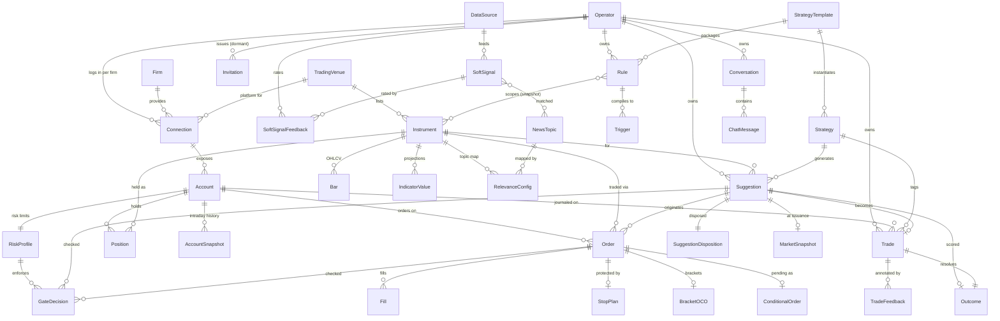

# Data Dictionary — Trading Co-Pilot

The authoritative catalog of the platform's **data entities, key fields, and storage**. This is a **design-time
model** derived from the [PRD](trading-platform-prd.md) + [ADRs](adr/) — the schema itself is not built yet; the
dictionary is kept **in lockstep with the `MarqSpec.TradingCopilot.Data` entities and `dotnet ef` migrations** as they land
(see *Maintenance* below). Companion to [engineering §2](trading-platform-engineering.md) (storage) and the
[architecture](trading-platform-architecture.md).

**Status:** scaffold · **Date:** 2026-07-18

## How to read this
- **Storage** column: `REL` relational · `TS` TimescaleDB hypertable (time-series) · `VEC` pgvector.
- **Traces**: the `R-#` / ADR that motivates the entity (one owner per concept — link here, don't re-describe).
- Listed fields are **key / representative**, not exhaustive; exact types firm up with the EF model.

## Conventions
- **Time:** every timestamp is `timestamptz` in **UTC**; session logic converts to CME/CT (R-13). **Trading day**
  vs. **calendar day** are tracked distinctly.
- **Money & prices:** `numeric` / decimal — **never float**. Quantities are contracts (integer) or `numeric`; each
  instrument carries **tick size** + **point value** for P&L math.
- **Identity:** surrogate PK (GUID or `bigint` — *Decide*) plus natural keys where stable.
- **Venue / source tagging (R-17):** instruments, accounts, orders, and fills carry a **venue** (execution) and/or
  **source** (data) tag end-to-end, so cross-source joins stay honest. These columns persist the domain vocabulary
  in `MarqSpec.TradingCopilot.Domain/Venue/` — `VenueId`, `VenueAccountId`, `VenueContractId` (`venue:key`).
- **Mode (R-14):** account / order / trade records carry **practice | live | undeclared** — an identical pipeline, distinguished
  only for safety and display. Persists `TradingMode`. **Mode is declared, not derived** (gh#60): the venue reports
  execution routing, the operator declares what each firm stage *means*, and an unclassified stage persists as
  **`undeclared`**. `TradingModePolicy` refuses a live account outside production and an **undeclared account
  everywhere, production included**.
- **Exclusion & soft-delete (R-15) — three orthogonal flags:** `training_excluded` (drop from the AI learning set),
  `hidden_from_user` (hide from journal / reports), and `deleted` (soft-delete; hard delete is a separate operation).
  A losing trade can stay **visible to the operator** while **excluded from training** — the two are set independently.
- **Audit (engineering §9):** every order action and guardrail decision is written to an immutable record.

## Model at a glance (ERD)
The relational **spine** — entities and how they relate. There is **one operator per deployment** (ADR-0017);
every operator-owned entity still carries an owning identity and is scoped to it, so a query that forgets its
scope returns nothing (R-20). Reference & market data is shared. Attributes live in the section tables below; this diagram
is the **map, not a second copy** of the fields, so it stays cheap to maintain. Kept **in lockstep** with the tables
+ `MarqSpec.TradingCopilot.Data`: update it in the **same PR** as any entity/relationship change (universal same-PR doc rule;
engineering §10, *Maintenance* below). Time-series detail (Quote / Tick / DepthLevel), the event backbone (Event /
ConsumerCursor), the polymorphic Embedding, and AuditRecord / AIUsage are cataloged in §2 / §10–§12 and omitted here
for legibility.

## 1. Reference & identity
| Entity | Key fields | Storage | Traces |
|---|---|---|---|
| **Instrument** | symbol, venue/source, asset class (future/equity/index/etf), exchange, tick size, point value, currency, session hours, **settlement / close time** (drives the per-instrument R-13 flatten default), contract/expiry | REL | R-1, R-13, R-17 |
| **TradingVenue** | name (ProjectX / Tradovate), kind = execution, capabilities (order types, data streams), hosts/endpoints, mode support | REL | R-17, ADR-0007 |
| **DataSource** | name (Finnhub / Tiingo), kind = data-only, capabilities (ws / rest, market / news), free-tier limits | REL | R-1, R-2, R-17 |
| **Strategy / Setup** | name (VWAP-reclaim, opening-drive…), description, enabled, **template lineage** (source StrategyTemplate + version, if installed from one) — the operator’s **editable instance** | REL | R-4, R-9, R-21 |
| **StrategyTemplate** (“playbook”) | name (e.g. 13/48 EMA-crossover, an ICT model), version, methodology tag, **source** (platform-curated / user-authored), **required features / indicators**, **setup definitions** (→ triggers), **suggestion shape** (entry / stop / target / size derivation), **risk defaults** (R-5), packaged **rules** (R-7); **install → instantiates** the operator’s own Strategy + Rule + Trigger + defaults, tracked by lineage. Curated templates ship global; operator-authored ones are operator-owned (R-20), and either can be **exported to a portable JSON artifact** for another deployment to import (gh#3, ADR-0017) | REL + VEC | R-21, R-7, R-4, R-5 |
| **User (Operator)** | id, **email**, credential (hashed, server-side), display name, created ts, status, claims / roles (RBAC-capable); **one per deployment** — provisioned at deploy, **no sign-up** (ADR-0017). Every operator-owned entity references its owning user, so a query that forgets its scope returns **nothing** rather than everything (R-20) | REL | R-18, R-20, ADR-0003, ADR-0017 |
| **Invitation** | id, **invited email**, token (hashed), **issued-by** user, status (pending / accepted / revoked / expired), created + **expires** ts, accepted-user (once used); **single-use**. **Built and dormant** (entity + endpoints + migration exist) — **not** part of the product's onboarding story, which seeds the single operator (ADR-0017). Retained rather than dropped because unwinding an applied migration costs more than keeping it, and it is the plumbing a future **read-only / mentee** login would reuse | REL | R-18, ADR-0017 |
| **Firm / account provider** | a **prop firm** (Topstep, Apex, …) **or a brokerage** (`FirmType`); the **platform(s) it offers** — **one-to-many**, e.g. Apex offers **Tradovate and Rithmic** while Topstep **owns ProjectX** and offers only that; its **stage conventions** (what Evaluation / Funded mean here — declared by the operator, applying across every platform the firm offers, gh#60); super-account concept (prop). **Operator-owned** (`IUserOwned`); unique per (owner, name). **Implemented** (gh#7): core `Firm` + `FirmStageConvention` children; offered-platforms + credentials still to land | REL | R-17, R-14 |
| **FirmStageConvention** | one operator declaration — `(firm, stage) → capital-at-risk` — composing a firm's domain `FirmConventions` (gh#60). **Operator-owned**; unique per (firm, stage); a **DB check constraint** refuses `Unknown` (0), the enum's fail-closed zero. Bridged to the domain value object by `Firm.ToConventions()` | REL | R-14, gh#7, gh#76 |
| **Connection** (a firm login) | operator, **firm** + **which of that firm's platforms** this login is for, credentials (server-side ref), status — **one per firm × platform** (Apex on Tradovate and Apex on Rithmic are two logins; several firms also share one platform → several logins on it); exposes many accounts. **Implemented** (gh#7): operator-owned; unique per (owner, firm, platform); **`CredentialKey` names an env entry — no secret is ever stored** (in-DB encrypted credentials are a later increment with their own key design); `status` still to land | REL | R-17, R-18 |

## 2. Market data (time-series)
Live stream and clean-historical are **distinct paths** (R-1); the historical series is the system of record.

| Entity | Key fields | Storage | Traces |
|---|---|---|---|
| **Bar (OHLCV)** | instrument, resolution, o/h/l/c, volume, bucket ts | TS | R-1 |
| **Tick / Trade** | instrument, price, size, aggressor side, ts (live tape) | TS | R-1, R-3 |
| **Quote** | instrument, bid, ask, bid/ask size, ts | TS | R-1 |
| **DepthLevel (DOM)** | instrument, side, price, size, ts (order book) | TS | R-1, R-3 |
| **IndicatorValue** | instrument, resolution, kind (RSI / MACD / VWAP / delta / volume-profile), value(s), ts — **pre-computed projection** | TS | R-3, ADR-0001 |

## 3. Account & positions
| Entity | Key fields | Storage | Traces |
|---|---|---|---|
| **Account** (a *trading account*) | **connection** (a firm login → operator + venue + firm; one login → **many** accounts); venue **account-id / sub-id** + **name** (`50KTC-V2-…`); **size / buying power** (50K / 100K / 150K — *notional, not the risk budget*), **type** (funded / evaluation / practice / **live-brokerage**), **stage** (evaluation / practice / funded), **status** (active / passed / failed / closed), **canTrade** + **isVisible** (broker flags) + **hidden-from-switcher** (operator preference) → **switcher-eligible = canTrade ∧ isVisible ∧ ¬hidden**, **mode** (practice / live / **undeclared** — declared per firm × stage, never derived; gh#60), **simulated** flag (the venue’s *execution-routing* fact, not the mode); balance, daily P&L, **max-loss limit** + **drawdown floor** — **trailing mode** (EOD | intraday), amount, current floor, **source** (**firm-imposed** → account-fail; *or* **self-imposed** on live/brokerage → halt + flatten), **daily-loss limit (DLL)**, currency. The floor fields are modeled by `Domain/Risk/TrailingDrawdown` (mode, amount, lock, current floor) + `AccountRiskRules`. **Implemented — discovery slice only** (gh#7): connection FK, venue account key + name, **stage** (persisted — the conservative resolver's reading, refreshed on every rediscovery) **+ `stageOverride`** (nullable — the operator's per-account declaration, gh#76: **effective stage = override ?? resolved**; a DB check refuses `Unknown` as an override — clearing it is how you say "I don't know"; rediscovery never touches it), canTrade/isVisible, balance; unique per (connection, venue key). **Deferred deliberately:** the risk-rule fields land with the risk persistence, and the **persisted `mode` column lands with the execution entities + their R-14 check constraint** — until then mode is *computed* from stage × firm conventions so it cannot go stale when a declaration changes | REL | R-1, R-5, R-14, R-17 |
| **Position** | account, instrument, size, avg price, unrealized P&L, opened ts | REL | R-1, R-5 |
| **AccountSnapshot** | account, ts, balance / P&L / headroom, **derived values** (buying power / stage / status), **`adapter_logic_version`** — the version of the adapter-derivation logic (Q-4) that computed the derived fields, so a past snapshot stays interpretable (and backtests / audits stay correct) when that logic later changes — intraday history feeding the risk layer + P&L-by-day | TS | R-5, R-9, ADR-0009 |

**Trading accounts (parity).** Structure: **operator → connection (a login _per firm_) → accounts**, where a
**platform** is the trading API (ProjectX/TopstepX, Tradovate) and a **firm** (Topstep, Apex, …) provides the
accounts. **Topstep runs its own platform (TopstepX)**, while **Apex, Take Profit Trader, TradeDay, The Funded
Trader, …** are separate firms **on Tradovate** — so the operator can have **several logins on one platform** (one
Tradovate login *per firm*). One operator therefore has **many trading accounts** (a practice account plus
several funded / evaluation accounts), the **same shape on both** — keep it **venue-neutral** (R-17). The ProjectX
API returns only `id / name / balance / canTrade / isVisible`; **buying power, stage, status and daily-loss limit are
name- or portal-derived** by the adapter (Q-4) — **practice-vs-live is not**: it comes from the operator’s firm conventions (gh#60). **Risk (R-5) applies per account** (each has
its own daily-loss + trailing drawdown); the operator **selects the active account**. The **account switcher lists only switcher-eligible accounts** —
`onlyActiveAccounts` ∧ `canTrade` ∧ `isVisible`, minus operator-**hidden** — while **passed / failed / closed and
hidden accounts stay in the full roster** (Settings › Account & venue), where a per-account toggle returns one to
the switcher. The **risk budget is the
headroom to the trailing-drawdown floor** — a $50K account with a $3K limit fails below **~$47K**, and the floor
**trails** the peak per firm rules — **not** the balance or buying power. A **live brokerage** (e.g. **Topstep
Brokerage** — real-money, CFTC-registered introducing broker) carries **no firm-imposed** floor; the operator sets
a **self-imposed** max-loss (R-5) that reuses the same trailing-floor machinery.

## 4. Orders & execution
| Entity | Key fields | Storage | Traces |
|---|---|---|---|
| **Order** | instrument, venue, account, side, size, type (mkt / limit / stop / trailing), price, status (working / partial / filled / cancelled / rejected), placement (**native / synthetic**), send mode (**now / on-trigger**), originating suggestion, **mode** (R-14) — **mode-guarded: `Order.mode` must equal `Account.mode`, enforced at the repository *and* a DB check constraint** (no live order on a practice account, or vice versa) | REL | R-11, R-14, ADR-0007 |
| **Fill (Execution)** | order, price, size, fees, ts — **native fills** | REL | R-8, R-11 |
| **Bracket / OCO** | parent order, stop leg, target leg, linkage | REL | R-11, ADR-0007 |
| **StopPlan** | trade / order, actual-stop price, **safety-stop** price (= max-DD-per-trade), promotion proximity, staged state (hidden / native), OCO linkage | REL | ADR-0007, R-5 |
| **ConditionalOrder** (pending) | trigger condition, **cancel-if / expiry**, native / synthetic, target order, status (pending / fired / cancelled / expired / **orphaned**) — a **synthetic** order whose managing connection drops goes **orphaned → emergency** (operator alerted; the always-native safety stop remains the floor; ADR-0007) | REL | ADR-0007, R-11/R-12 |

## 5. Risk
| Entity | Key fields | Storage | Traces |
|---|---|---|---|
| **RiskProfile / Limits** (risk tolerance) | prop rules (daily loss, trailing DD), fixed **%-risk per trade**, **target R:R** (reward:risk, e.g. 1.5 : 1), manual (max contracts, per-instrument caps, **max-DD-per-trade**), **daily governor**, **daily profit target** + **consistency target** (max best-day % of total profit → **stand-down on reach**: suppress suggestions + optional stop-for-day), sizing basis (actual / safety), **kill-switch mode** (flatten-all | halt-only; default flatten-all), **auto-flatten — per instrument**: **enabled** (default **on** — best practice; disabling a market is a deliberate, warned override at own risk, R-13) + **deadline** (nullable override; null → the instrument's session-close default); GC / CL / ES / NQ close/settle at different times — equity-index ~2:30 PM CT pre-MOC, crude/gold earlier; R-13 / ADR-0013 — all configurable; **seeds sizing + the R:R KPI**. Persists the domain vocabulary in `Domain/Risk/` — `RiskProfile`, `ManualCaps`, `SanityCaps`; the consistency target, kill-switch mode, and auto-flatten config are specified here but not yet in code | REL | R-5, R-9, R-13, ADR-0007, ADR-0013 |
| **GateDecision** | suggestion / order, computed size, **binding layer**, outcome (allow / block / resize / acknowledge), ts — auditable. Persists `Domain/Risk/GateDecision` + `RiskLayer`; `acknowledge` arrives with the arm/edit flow (S3) | REL | R-5, R-16, ADR-0007 |

## 6. Suggestions
| Entity | Key fields | Storage | Traces |
|---|---|---|---|
| **Suggestion** | instrument, direction, entry, stop, target(s), size, confidence, validity window, strategy, rationale (signals cited), version / supersedes, **lifecycle state** (active / stale / expired-void), mode | REL + VEC | R-4, R-8 |
| **SuggestionDisposition** | suggestion, disposition (taken / modified / passed / expired), **pass reason(s)** + note, ts | REL | R-4, R-8 |
| **MarketSnapshot** | suggestion, condition snapshot at issuance (indicators, order-flow, price, news refs) | REL / VEC | R-8 |

## 7. Journal & outcomes
| Entity | Key fields | Storage | Traces |
|---|---|---|---|
| **Trade** | originating suggestion, instrument, side, entry / exit, size, realized P&L, R multiple, strategy, fills, mode, annotations | REL | R-8, R-9 |
| **TradeFeedback** | trade, comment, tags, emotional state, **awaiting-review** flag, author (operator / AI), ts | REL | R-8, R-6 |
| **Outcome** | suggestion / trade, resolution (win / loss / **no-fill-scratch** / expired), simulated?, calibration (predicted vs realized), **`training_excluded`** (drop from the AI learning set) · **`hidden_from_user`** (hide in journal / reports) · `deleted` (soft-delete) — **three independent flags**, so a real losing trade can stay visible to the operator yet be excluded from training | REL | R-9, R-15 |

## 8. Rulebook & triggers
| Entity | Key fields | Storage | Traces |
|---|---|---|---|
| **Rule** | intent text, structured form, enabled, source conversation, confirmed, **`instrument_dependency_snapshot`** (the Instrument / RelevanceConfig metadata the rule resolved against **at confirmation**), **`needs_revalidation`** — if that metadata later changes (symbol reclassified, topic remapped) the rule is **flagged for review** so a stale trigger can't fire on the wrong asset | REL + VEC | R-7 |
| **Trigger / Condition** | compiled condition (DSL), route (**mechanical-alert / agent-review**), debounce / rate-limit, enabled, source rule | REL | ADR-0008, R-4/R-7 |

## 9. Non-market / soft signals
News is the reference template; other non-market feeds reuse this shape (R-2).

| Entity | Key fields | Storage | Traces |
|---|---|---|---|
| **SoftSignal (NewsItem)** | source, type (news / social / …), published + crawl ts, title, content, url, tickers, **matched instruments / topics** (relevance), tags, **dedup key**, **provenance (source feeds[])**; sentiment **deferred** | REL + VEC | R-2 |
| **NewsTopic** | name, tags / keywords / embedding, scope (instrument \| global) | REL + VEC | R-2 |
| **RelevanceConfig / TopicMap** | ticker↔instrument maps (SPY→ES), per-instrument topics, global topics; **AI-suggested + user-curated** (config panel); **personalized importance weights** learned from `SoftSignalFeedback` stars (per-dimension salience multipliers, ADR-0014) | REL | R-2, R-6/R-7, ADR-0014 |
| **SoftSignalFeedback** | per-user feedback on a soft-signal / news item: **kind** (**important / star** \| sentiment 👍/👎 \| **mute**), value / weight, ts, **user**; a **star** raises the personalized **salience** of similar future items (aggregated into `RelevanceConfig` weights) — a **soft signal, never a risk control**; transparent + adjustable (un-star / mute, salience floor) | REL | R-2, R-6, R-9, ADR-0014, ADR-0017 |

## 10. Vectors & retrieval
| Entity | Key fields | Storage | Traces |
|---|---|---|---|
| **Embedding** | owner type + id (suggestion / rule / soft-signal / snapshot), vector, model (Cohere), created ts | VEC | eng §2 |

## 11. Event backbone
Short retention on the event log (< 24h, likely < 1h); the clean-historical store carries the long retention (ADR-0001).

| Entity | Key fields | Storage | Traces |
|---|---|---|---|
| **Event** | envelope: type, source, occurred-at, **monotonic seq**, trace context, payload — append-only | TS | ADR-0001, ADR-0002 |
| **ConsumerCursor** | consumer group, last-processed seq / time | REL | ADR-0001 |

## 12. Chat & audit
| Entity | Key fields | Storage | Traces |
|---|---|---|---|
| **Conversation / ChatMessage** | role, content, tool invocations, grounding refs, ts — persists across sessions | REL + VEC | R-6 |
| **AuditRecord** | actor, action (order / guardrail / kill / flatten / **connection-loss**), **placement (native / synthetic)** + **`synthetic_risk`** (a live position resting on an in-app synthetic stop / bracket — an **orphan risk** if the connection drops), before → after, ts — immutable | REL / TS | eng §9, ADR-0007 |
| **AIUsage** | invocation: feature (suggestion / follow-up / backtest / triage / embed), model + tier, tokens in/out, **est. $ cost**, latency, trace id, ts, **user** — spend tracking + governor input. Surfaced **both ways**: aggregated in **Grafana** (ADR-0002) for the operational view, and **read back in the app** for the spend meter — cost per suggestion, cost per taken trade, cap remaining (gh#62). The spend is the operator's own, billed to their own keys (ADR-0015) | REL / TS | ADR-0008, ADR-0002, Q-10 |

## Cross-cutting
- **Data isolation (R-20).** One operator per deployment (ADR-0017). **Reference & market data** — Instrument,
  TradingVenue, DataSource, Firm (§1), all market series (§2), and raw SoftSignal / news (§9) — is **shared / global**.
  **All operator-owned data** — Connection, Account, Position, AccountSnapshot, RiskProfile, GateDecision, Suggestion
  (+ disposition / snapshot), Order / Fill / StopPlan / ConditionalOrder / Bracket, Trade / TradeFeedback / Outcome,
  Rule / Trigger, RelevanceConfig, Embedding, Conversation / ChatMessage, AuditRecord, AIUsage, SoftSignalFeedback — carries an **owning
  `user_id`** and is **filtered by the authenticated user at the data layer** (row-level scoping, **default-deny**),
  enforced below the UI. With **one operator per deployment** (ADR-0017) this is a **fail-closed safety property**,
  not a tenancy feature: a query that forgets its scope returns *nothing* instead of *everything*, and a second
  login stays possible later without reworking the data layer. **In code (gh#7):** operator-owned entities
  implement `IUserOwned` and `TenantDbContext` applies the default-deny filter automatically; a **guard test**
  fails if an entity is added that is neither owned nor an *acknowledged global*, so the filter cannot be
  forgotten on a new entity. `Firm` is the first operator-owned entity to land. *(Event-log scoping — a mix of shared market and
  operator decision events — is an open item; see [ADR-0017](adr/0017-single-operator-data-isolation.md).)*
- **Venue/source-tagging** end-to-end (R-17) — e.g. Finnhub `SPY` vs. ProjectX `ES` never conflate.
- **Practice vs. live** is a **tag**, not a separate schema (R-14) — identical ingestion / journaling / learning —
  **but mode-guarded:** an `Order` / `Suggestion` `mode` **must equal its `Account.mode`**, enforced at the
  **repository + a DB check constraint** (not only the service layer), so a live order can never be journaled against
  a practice account, or vice versa. An **`undeclared`** account produces no orders at all — `TradingModePolicy`
  refuses it in every environment — so the constraint never sees that mode on an `Order` (gh#60).
- **Adapter-derived values are versioned (Q-4).** Fields the adapter *computes* from a raw venue API (buying power,
  stage, status — but **not** practice-vs-live, which is declared rather than computed) are stamped with the
  **`adapter_logic_version`** that produced them and historized
  in `AccountSnapshot`, so a past snapshot stays interpretable — and backtests / audits stay correct — after the
  derivation logic changes (ADR-0009, eng §9).
- **Exclusion & soft-delete (R-15) are three orthogonal flags** — `training_excluded` (AI learning set),
  `hidden_from_user` (journal / reporting visibility), `deleted` (soft-delete). A losing trade can stay visible to
  the operator yet be excluded from training.
- **Synthetic orders carry orphan risk (ADR-0007).** A synthetic / in-app stop or bracket needs the connection live;
  on connection loss the affected orders move to **orphaned → emergency**, the operator is alerted, and the
  `AuditRecord` flags the `synthetic_risk`. Protective stops therefore **default to native** (exchange-held);
  synthetic is an explicit opt-in.
- **Deterministic vs. proposed:** indicators (ADR-0001), the risk gate (ADR-0007), and triggers (ADR-0008) are
  computed / enforced deterministically; suggestions, rules, and feedback follow-ups are data the **LLM proposes**.

## Open items
- Surrogate-key type (GUID vs. `bigint`) and natural keys.
- TimescaleDB hypertable + retention / compression choices per series.
- The **trigger / condition DSL** schema (ADR-0008 follow-up).
- Embedding model / dimensions (Cohere) and which entities are embedded.
- Fees / commission model; multi-currency.

## Maintenance
This dictionary is kept **in lockstep with `MarqSpec.TradingCopilot.Data`**: when a `dotnet ef` migration adds, renames, or
removes an entity or a load-bearing field, update the matching row here **in the same PR** (cite the migration). It
is the **one authoritative catalog** of the data model — link here rather than re-describing entities elsewhere. As
domains deepen, split a section into its own page and leave a pointer.
