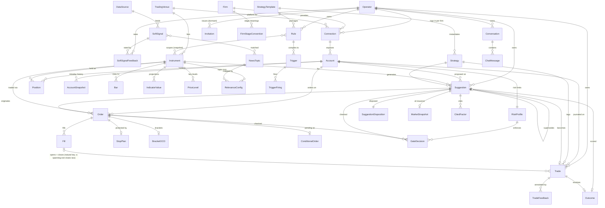

# Data Dictionary — Trading Co-Pilot

The authoritative catalog of the platform's **data entities, key fields, and storage**. Begun as a **design-time
model** derived from the [PRD](trading-platform-prd.md) + [ADRs](adr/), it is now **partially implemented** — rows
carry an **Implemented** marker (with the issue) as their entity lands — and the dictionary is kept **in lockstep
with the `MarqSpec.TradingCopilot.Data` entities and `dotnet ef` migrations** (see *Maintenance* below). Companion to [engineering §2](trading-platform-engineering.md) (storage) and the
[architecture](trading-platform-architecture.md).

**Status:** living — implemented rows are marked per entity · **Date:** 2026-07-22, last reconciled 2026-07-30 (gh#490)

## How to read this
- **Storage** column: `REL` relational · `TS` TimescaleDB hypertable (time-series) · `VEC` pgvector.
- **Traces**: the `R-#` / ADR that motivates the entity (one owner per concept — link here, don't re-describe).
- Listed fields are **key / representative**, not exhaustive; exact types firm up with the EF model.

## Conventions
- **Time:** every timestamp is `timestamptz` in **UTC**; session logic converts to CME/CT (R-13). **Trading day**
  vs. **calendar day** are tracked distinctly.
- **Money & prices:** `numeric` / decimal — **never float**. Quantities are contracts (integer) or `numeric`; each
  instrument carries **tick size** + **point value** for P&L math.
- **Identity:** surrogate PK (GUID or `bigint` — *Decide*) plus natural keys where stable.
- **Venue / source tagging (R-17):** instruments, accounts, orders, and fills carry a **venue** (execution) and/or
  **source** (data) tag end-to-end, so cross-source joins stay honest. These columns persist the domain vocabulary
  in `MarqSpec.TradingCopilot.Domain/Venue/` — `VenueId`, `VenueAccountId`, `VenueContractId` (`venue:key`).
- **Mode (R-14):** account / order / trade records carry **practice | live | undeclared** — an identical pipeline, distinguished
  only for safety and display. Persists `TradingMode`. **Mode is declared, not derived** (gh#60): the venue reports
  execution routing, the operator declares what each firm stage *means*, and an unclassified stage persists as
  **`undeclared`**. `TradingModePolicy` refuses a live account outside production and an **undeclared account
  everywhere, production included**.
- **Exclusion & soft-delete (R-15) — three orthogonal flags:** `training_excluded` (drop from the AI learning set),
  `hidden_from_user` (hide from journal / reports), and `deleted` (soft-delete; hard delete is a separate operation).
  A losing trade can stay **visible to the operator** while **excluded from training** — the two are set independently.
- **Audit (engineering §9):** every order action and guardrail decision is written to an immutable record.

## Model at a glance (ERD)
The relational **spine** — entities and how they relate. There is **one operator per deployment** (ADR-0017);
every operator-owned entity still carries an owning identity and is scoped to it, so a query that forgets its
scope returns nothing (R-20). Reference & market data is shared. Attributes live in the section tables below; this diagram
is the **map, not a second copy** of the fields, so it stays cheap to maintain. Kept **in lockstep** with the tables
+ `MarqSpec.TradingCopilot.Data`: update it in the **same PR** as any entity/relationship change (universal same-PR doc rule;
engineering §10, *Maintenance* below). Time-series detail (Quote / Tick / DepthLevel), the event backbone (Event /
EventCursor), the polymorphic Embedding, AuditRecord / AIUsage, and the two relation-less deployment singletons —
**KillSwitchState** (one row per deployment) and **NotificationOutbox** (owed pages, drained by the relay) — are
cataloged in §2 / §4 / §10–§12 and omitted here for legibility.

## The domains — open one, not the file

Each domain is its own page so a schema question costs a ~2K read instead of ~24K. **The `§N` numbers are
stable and are cited from C# XML-doc comments** (e.g. `(data dictionary §4)`) — they are a public
identifier, so a domain is never renumbered.

| § | Domain | ~tok | What is in it |
|---|---|---:|---|
| **§1** | [Reference & identity](data-dictionary/01-reference-identity.md) | 2117 | Instrument, TradingVenue, DataSource, Strategy, StrategyTemplate, User, Invitation, Firm, FirmStageConvention, Connection |
| **§2** | [Market data (time-series)](data-dictionary/02-market-data.md) | 1942 | Bar, Tick, Quote, DepthLevel, IndicatorValue, PriceLevel, Event, EventCursor — **and §11 Event backbone**, folded here because it only pointed at these rows |
| **§3** | [Account & positions](data-dictionary/03-account-positions.md) | 1657 | Account, Position, AccountSnapshot, plus the trading-account parity notes |
| **§4** | [Orders & execution](data-dictionary/04-orders-execution.md) | 7301 | Order, Fill, Bracket/OCO, StopPlan, ConditionalOrder, KillSwitchState, NotificationOutbox — **the largest domain** |
| **§5** | [Risk](data-dictionary/05-risk.md) | 1542 | RiskProfile / Limits, GateDecision |
| **§6** | [Suggestions](data-dictionary/06-suggestions.md) | 3272 | Suggestion, SuggestionDisposition, MarketSnapshot, CitedFactor |
| **§7** | [Journal & outcomes](data-dictionary/07-journal-outcomes.md) | 403 | Trade, TradeFeedback, Outcome |
| **§8** | [Rulebook & triggers](data-dictionary/08-rulebook-triggers.md) | 1421 | Rule, Trigger / Condition, TriggerFiring |
| **§9** | [Non-market / soft signals](data-dictionary/09-soft-signals.md) | 1271 | SoftSignal (NewsItem), NewsTopic, RelevanceConfig / TopicMap, SoftSignalFeedback |
| **§10** | [Vectors & retrieval](data-dictionary/10-vectors-retrieval.md) | 417 | Embedding — the polymorphic `VEC` row |
| **§12** | [Chat & audit](data-dictionary/12-chat-audit.md) | 1853 | Conversation / ChatMessage, AuditRecord, AIUsage |

## Cross-cutting
- **Data isolation (R-20).** One operator per deployment (ADR-0017). **Reference & market data** — Instrument,
  TradingVenue, DataSource (§1), all market series (§2), and raw SoftSignal / news (§9) — is **shared / global**,
  as is the deployment-wide **KillSwitchState** (§4). The full set of **acknowledged globals** — entities
  deliberately *not* `IUserOwned`, each with its reason — is pinned **by name** in the `DataLayerScopingTests`
  guard (**13** entries as of gh#490), in two groups. **Reference / market / derived data**, global by R-20's own
  *"reference & market data is shared"* rule (a tenant filter there would hide the market from the operator trading
  it): **BarRecord** (gh#302), **IndicatorValueRecord** (gh#310), **NewsRecord** (gh#358), **EmbeddingRecord**
  (gh#109), and the relevance config **TickerInstrumentMap** / **NewsTopic** / **RelevanceConfigState** (gh#359).
  **Deployment plumbing**, global by exception: **User** (the tenant root — it owns rows, it is not owned),
  **Invitation** (resolved by token hash before a user exists, R-18), **Event** + **EventCursor** (backbone
  plumbing, ADR-0001), **KillSwitchState** (one row per deployment, gh#189), and **NotificationOutboxRecord**
  (owed to the deployment; the relay drains it with no authenticated identity, gh#400). A new entity that is
  neither owned nor on that list **fails the build**, so "not owned" is always a recorded decision rather than an
  omission. A distinct wrinkle (gh#436): the deployment **`SystemOwner`**
  is a **non-operator *owner*** of `IUserOwned` rows — currently global AI embed spend — a well-known **non-empty**
  Guid distinct from `Guid.Empty`, so those rows stay default-deny-scoped (invisible to the operator, readable only
  under the sentinel's own scope) rather than becoming an acknowledged *global*; **`AIUsage` is therefore *not*
  added to the acknowledged-globals list** above — it is a normally-owned entity that simply has one non-operator
  owner.
  **All operator-owned data** — Firm / FirmStageConvention, Connection, Account, Position, AccountSnapshot, RiskProfile, GateDecision, Suggestion
  (+ disposition / snapshot / cited factors), Order / Fill / StopPlan / ConditionalOrder / Bracket, Trade / TradeFeedback / Outcome,
  Rule / Trigger, RelevanceConfig, Embedding, Conversation / ChatMessage, AuditRecord, AIUsage, SoftSignalFeedback — carries an **owning
  `user_id`** and is **filtered by the authenticated user at the data layer** (row-level scoping, **default-deny**),
  enforced below the UI. With **one operator per deployment** (ADR-0017) this is a **fail-closed safety property**,
  not a tenancy feature: a query that forgets its scope returns *nothing* instead of *everything*, and a second
  login stays possible later without reworking the data layer. **In code (gh#7):** operator-owned entities
  implement `IUserOwned` and `TenantDbContext` applies the default-deny filter automatically; a **guard test**
  fails if an entity is added that is neither owned nor an *acknowledged global*, so the filter cannot be
  forgotten on a new entity. `Firm` is the first operator-owned entity to land. *(Event-log scoping — a mix of shared market and
  operator decision events — is an open item; see [ADR-0017](adr/0017-single-operator-data-isolation.md).)*
- **Venue/source-tagging** end-to-end (R-17) — e.g. Finnhub `SPY` vs. ProjectX `ES` never conflate.
- **Practice vs. live** is a **tag**, not a separate schema (R-14) — identical ingestion / journaling / learning —
  **but mode-guarded:** an `Order` / `Suggestion` `mode` **must equal its `Account.mode`**, enforced at the
  **repository + a DB check constraint** (not only the service layer), so a live order can never be journaled against
  a practice account, or vice versa. An **`undeclared`** account produces no orders at all — `TradingModePolicy`
  refuses it in every environment — so the constraint never sees that mode on an `Order` (gh#60).
- **Adapter-derived values are versioned (Q-4).** Fields the adapter *computes* from a raw venue API (buying power,
  stage, status — but **not** practice-vs-live, which is declared rather than computed) are stamped with the
  **`adapter_logic_version`** that produced them and historized
  in `AccountSnapshot`, so a past snapshot stays interpretable — and backtests / audits stay correct — after the
  derivation logic changes (ADR-0009, eng §9).
- **Exclusion & soft-delete (R-15)** — the three orthogonal flags are defined once under *Conventions* above
  (`training_excluded` / `hidden_from_user` / `deleted`); **persisted on the `Outcome` entity and set only through its
  methods** so they can't be re-collapsed — soft-delete is the reversible combined shortcut, the two are settable
  independently (gh#832).
- **Synthetic orders carry orphan risk (ADR-0007).** A synthetic / in-app stop or bracket needs the connection live;
  on connection loss the affected orders move to **orphaned → emergency**, the `AuditRecord` flags the
  `synthetic_risk` (now written per transition, gh#220), and the operator is alerted (a high-severity log until the
  real-time channel lands, gh#222). Protective stops therefore **default to native** (exchange-held);
  synthetic is an explicit opt-in.
- **Deterministic vs. proposed:** indicators (ADR-0001), the risk gate (ADR-0007), and triggers (ADR-0008) are
  computed / enforced deterministically; suggestions, rules, and feedback follow-ups are data the **LLM proposes**.

## Open items
- Surrogate-key type (GUID vs. `bigint`) and natural keys.
- TimescaleDB hypertable + retention / compression choices per series.
- The **trigger / condition DSL** — only if a future condition kind needs one. gh#385 shipped the first kind (indicator-threshold) as **typed columns + a `ConditionKind` discriminator**, so a second kind (order-flow, composite) is additive nullable columns rather than a DSL (ADR-0008 follow-up).
- Embedding model / dimensions (Cohere) and which entities are embedded.
- Fees / commission model; multi-currency.

## Maintenance
This dictionary is kept **in lockstep with `MarqSpec.TradingCopilot.Data`**: when a `dotnet ef` migration adds, renames, or
removes an entity or a load-bearing field, update the matching row here **in the same PR** (cite the migration). It
is the **one authoritative catalog** of the data model — link here rather than re-describing entities elsewhere.

**Adding or changing a row:** edit the **domain page**, not this index. This index carries only what spans
domains — the ERD, *How to read this*, *Conventions*, *Cross-cutting* and the routing table above. A new entity
adds a row to its domain page; a new **domain** adds a page *and* a routing row, in the same PR.

**Never renumber a domain.** The `§N` identifiers are cited from C# XML-doc comments across the solution
(`(data dictionary §4)`), so a renumber silently invalidates them. §11 folded into §2 rather than being deleted,
and its routing row still resolves, for exactly this reason. (gh#616 performed this split; before it, the whole
catalog was one ~25K-token file.)
