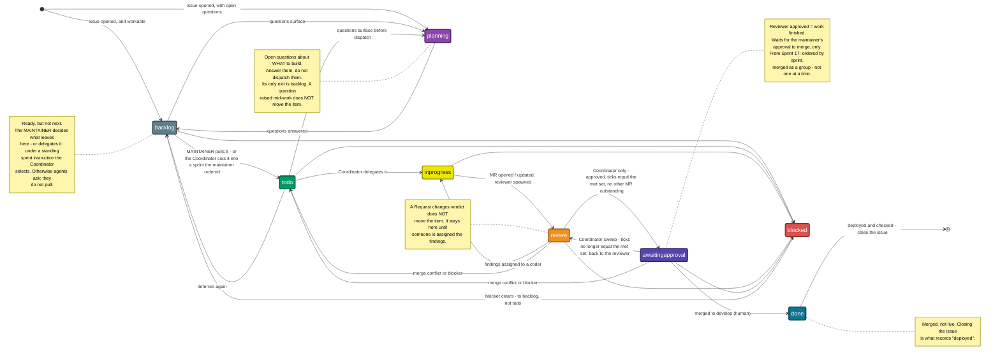

# pr-workflow — how a change gets from a branch to `main` (GitLab-era example)

> **Example, not this repo's process (gh#1218).** Imported from a sibling project that runs on GitLab: what it calls
> a *merge request (MR)* is a *pull request (PR)* here, its scoped `work::` labels are this repo's `work:*` work-type
> labels plus Project board columns, and its pipeline is GitLab CI, not GitHub Actions. Read it for the shape of a
> mature review-and-promotion flow. **This repo's process is
> [`project-board-workflow.md`](../project-board-workflow.md) and [`CONTRIBUTING.md`](../../CONTRIBUTING.md).**
> Not translated to GitHub yet; the differences are expected.

The lifecycle every change moves through, and who acts at each step. Written down because the
[Coordinator](agents/coordinator.md) drives it, and a role that drives an undocumented process is inventing
one.

**The tracker of record is GitLab** — project 2045, `<group>/<project>` (`INDEX.md` §5). That is
where the issue is filed and where the merge request is opened, reviewed and merged. Which remote *name*
points there is a property of your clone, not of this repo — run `git remote -v`. Cite with a sigil — `gl#N` an issue, `gl!N` a merge request, `gh#N` GitHub —
and never a new `gitlab#N`, which is the retired instance and now opens the *wrong* page. That rule governs
**repo files**; inside a GitLab issue or MR **body** both `Closes #N` and `Related to #N` stay **bare**,
because each is the host's own cross-reference syntax and a sigil kills it — `Closes gl#427` closes nothing,
`Related to gl#427` links nothing. **Watch the closing keyword:** it closes the issue *anywhere* in a body,
however the sentence reads, so writing **about** a citation arms it — check `closes_issues` before you rely
on a description (`INDEX.md` §5).

## The flow



Two edges carry most of the meaning. **`review → inprogress` fires on assignment, not on the verdict** — a
changes-requested MR nobody has picked up is waiting for a person, and should look like it. And
**`blocked → backlog`, never `blocked → inprogress`** — by the time a blocker clears, the branch has fallen
behind and the context is gone, so the item returns to `work::backlog` rather than resuming. Not
`work::todo` either: being unblocked is not the same as being next, and only a promotion makes it next —
the maintainer's, or the Coordinator's in a sprint the maintainer ordered.

## The states

| State | Board label | What it means | Who moves it on |
|---|---|---|---|
| **Planning** | `work::planning` | The issue exists but is **not answerable as written** — open questions about what to build, or whether to. **Its only exit is `work::backlog`**; see below | human, or Coordinator |
| **Backlog** | `work::backlog` | Workable and **deliberately deferred**: criteria could be written today, nothing is in the way, it is simply not next. Where a workable issue lands by default. **Carries exactly one `priority::` label, and the column is kept in priority order** — see below | human, or Coordinator |
| **Issue open** | `work::todo` | Pulled for imminent work — **the only queue the Coordinator delegates from**. **The maintainer decides what is promoted here** — except under the maintainer's standing instruction to cut sprints, which delegates the selection to the Coordinator: it selects, records its rationale in the sprint milestone's description, and the maintainer can override. Otherwise an agent asks, it does not pull. No orphaned MRs — root `AGENTS.md` | **maintainer** — or the **Coordinator**, in a sprint cut under that instruction |
| **Branch** | `work::inprogress` | `feat/…`, `fix/…`, `chore/…`, `docs/…` off `develop`, ideally in its own worktree | **Coordinator dispatches**; the change-making agent does the work |
| **Local gates** | `work::inprogress` | `dotnet format --verify-no-changes`, unit + eval tests, and any gate the change touches | the change-making agent |
| **MR open** | `work::review` | Targets `develop`, **links the issue it derives from** (`Closes #N` / `Related to #N`, bare), describes what was verified. No link, no MR — see below | the change-making agent |
| **Reviewed** | `work::review` | The MR is put in front of a Code Reviewer, and whoever did that blocks on the verdict. On GitLab **little enforces this** — `review-verdict` runs now (`gl#421` cleared) but only while the workstation runner is up, and fails closed without a readable `GITLAB_API_TOKEN`, so the author's discipline is still effectively the whole mechanism (`CI-SETUP.md` §7–§8) | the change-making agent spawns it — **except the [Wiki Editor](agents/wiki-editor.md)**, which hands the MR iid back and its caller spawns it |
| **Changes requested** | stays `work::review`, → `work::inprogress` **on assignment** | The reviewer ruled `Request changes`, or a human asked. The verdict alone does not move it — the agent picking the findings up does | Coordinator dispatches per finding, to the role the change belongs to: Coding, Platform, Integration Testing — or the **Wiki Editor** on its own MR, since the findings are about whole documents and it is the one holding that context |
| **Green** | `work::awaitingapproval` — **once every MR for the issue is approved** | `STATE=approved`, the gates the author ran pass — on GitLab the local ones are all there are — MR description matches what landed. **The issue's acceptance-criteria boxes are ticked by the reviewer**, only for criteria it verified, and its verdict lists every criterion as met, not met or not verifiable from this change — see below. **From Sprint 17, this is not a queue for individual merges**: the column is kept ordered by `Sprint N` milestone and the item waits for its whole sprint's group approval — see below | **the Coordinator only**, after its acceptance-criteria check (maintainer ruling, `gl#684`). An author on an approval leaves the item in `work::review` and hands it over; with no Coordinator session running it waits there. **Nobody but the reviewer ticks** |
| **Merged** | `work::done` — a `sweep` issue is closed instead (*Issue closed*, below) | Merge commit to `develop` (this repo does not squash), **as part of the sprint's group approval from Sprint 17 on** (`gl#793`) — not merged individually as each item goes green | **human only** — gh#401 revisits this |
| **Promoted** | `work::done` | `develop` → `main` in its own MR | human |
| **Deployed** | *(close the issue)* | The change is *running* in the environment it was for: image built, pin updated, redeployed, and checked. For production the release step closes it (*From Done to closed*, below) | human — the operator's release step (`gl#789`) |
| **Issue closed** | — | **Closed means deployed.** That is the definition — not merged, not approved, not "we are done with it". `Closes #N` on the MR closes it at **merge**, which is early, so reopen it into `work::done`, or cite `Related to #N` when the deploy is a separate step. **The one exception is a Wiki Editor sweep's issue** (label `sweep`): it has nothing to deploy, so it is closed when its MR merges (maintainer ruling, `gl#736`). **Take the `work::` label off as you close** — see below | human, or Coordinator |

> **Closed = deployed.** A closed issue is a claim that the change is live in the environment it was for. If
> you cannot point at it running, it is not closed — it is `work::done`. That single rule is what makes the
> board's right-hand end mean anything: without it, Done and Closed both degrade into "somebody stopped
> looking at this". **One stated exception:** a Wiki Editor sweep's issue, labelled `sweep`, closes when its
> MR merges, because a documentation sweep has nothing to deploy (maintainer ruling, `gl#736`).

### Every MR links to the issue it derives from

**An MR with no issue link is not traceable in either direction** — you cannot get from the issue to the
change that answers it, and you cannot get from the change to why it was made. The board is built out of
issues, so an unlinked MR is also invisible to it: no column moves, and the work happens off the record.

Use the host's own bare form, which is the one exception to the sigil rule:

- **`Related to #N`** — the default here. It creates the backlink and leaves closing to a human, which is
  what you want when the deploy is a separate step, because **closed means deployed**.
- **`Closes #N`** — only when the merge really is the finish line. It closes the issue at *merge*, which is
  early for anything that still has to be built, pinned and redeployed.

**A docs-only change is not an exception.** It has no image and no pin, but it is not live where anyone
reads it until `develop` is promoted to `main` — so it too is `work::done` at merge and closed after the
promotion. The rule has **one** carve-out, and the maintainer made it, not the change: **a Wiki Editor
sweep's issue, labelled `sweep`, closes when its MR merges** (maintainer ruling, `gl#736`), and stays
findable by that label, any sprint milestone and the closed date. No other change gets one, which is what
keeps the rule checkable: "closed means deployed" is worthless if each change gets to decide what deployed
means for it.

**Verify the link rather than assuming it.** `Closes #N` shows up in the MR's `closes_issues`; `Related to
#N` does not — it only mints a "mentioned in" backlink — so an MR can be correctly linked and still return an
empty `closes_issues`. Check the body for the reference, not just the API field, and check `closes_issues`
separately for the *opposite* reason: a closing keyword anywhere in a body arms that number, so a description
that merely discusses `Closes #N` can close an unrelated issue.

**And the description is not the only place that arms it — commit messages count too.** GitLab collects
closing keywords from the body, the MR **title**, and **every commit on the branch**. So rewording the
description alone does **not** disarm a `Closes #N` written into a commit earlier in the branch's history.

**All three sources are gated on the target branch, and the gate is all-or-nothing.** Closing keywords fire
only when the MR targets the project's **default branch** — `develop` here — so on a `develop` → `main`
promotion MR **nothing** auto-closes, not merely the commit half. Verified: `gl!371` targets `main`, carries a
commit whose message holds a closing keyword, and its `closes_issues` is empty. For ordinary work aimed at
`develop`, treat the rule as always on. Short of rewriting
published history — which is worse, because it invalidates any review bound to those SHAs — that issue *will*
auto-close at merge. The remedy is the one already in the states table: let it close, then reopen it into
`work::done` and say what deploy step is outstanding. Decide the citation form in the **first** commit, not
at the end.

### `work::backlog` — ready, but not next, and the maintainer owns it

**A workable issue lands in Backlog, not To Do.** It is ready in every sense — the criteria could be written
today and nothing is in the way — it is simply not what the project is doing next. Without this column, "the
queue the Coordinator delegates from" is the whole open backlog, which means nothing.

**Outside a sprint, nothing leaves Backlog without the maintainer.** An agent may *propose* promotions —
"these three look next, promote them?" — and may move items **into** Backlog as information arrives. It may
not pull one out. **The one exception is the maintainer's standing instruction to the Coordinator to cut
sprints**, which delegates the selection itself (maintainer ruling, `gl#736` note 87856): the Coordinator
chooses what a sprint promotes, by priority, workability without a pending maintainer ruling, overlap with
approved-but-unmerged MRs and any focus the maintainer stated; records its rationale in the sprint
milestone's description; and the maintainer can override any cut
([`coordinator.md`](agents/coordinator.md) *Sprints*).

**And it is not a priority filter.** `priority::urgent` / `priority::high` say where an item sits *within*
To Do — or within Backlog — once it is there; they never decide whether it gets in. Promoting "everything
marked high" is the same mistake as dispatching from Backlog — it hands the roadmap to whoever last labelled an issue, and it leaves
unlabelled work permanently invisible.

**It is, though, kept in priority order** (maintainer instruction, 2026-09-23). Every issue filed or moved
into `work::backlog` carries **exactly one** `priority::` label — `urgent` > `high` > `medium` > `low` — set
in the same step and proposed, with a one-line reason, by whoever puts it there; the maintainer may
re-prioritise at any time. The column runs strictly by tier, and within a tier only one ordering means
anything: a prerequisite sits above what depends on it. So a new item goes at the end of its tier, or
directly above the first item in that tier that depends on it, whichever is higher. A tier the maintainer set
always wins, and since agents and maintainer write as the same GitLab user, an agent that cannot tell whose a
tier is asks rather than guesses. **Ordering the
column is not promoting from it**, and the paragraph above still stands: the order is what the filers
thought mattered, not a queue anyone draws from top-down — cutting a sprint under the maintainer's standing
instruction draws from it no more mechanically than any other promotion does; priority is one of the four
things the Coordinator weighs in selecting it, never the whole test. The Coordinator's sweep enforces both
the label and the order, and [`coordinator.md`](agents/coordinator.md) *Backlog is kept in priority order* owns the rule,
the reorder mechanics, and how the items that predate it are handled.

**Promoting needs permission; demoting does not.** An agent is free to read what is in To Do and judge
whether it can actually be worked, and to move it out when it cannot — to `work::planning` if it needs a
ruling from the maintainer, or back to `work::backlog` if it simply should not be done now. That is not
overriding the maintainer's prioritisation, it is reporting that an item is not what it looked like. **An
item waiting on a human decision does not belong in To Do**, because To Do means ready to dispatch; leaving
it there with the question buried in a note is how To Do fills with things nobody can start.
Deciding what is worked next is a prioritisation judgement about the project, not a queue operation, and an
agent that promotes on its own authority — without the maintainer's say-so, per item or as a standing sprint
instruction — has quietly reset the roadmap. The Coordinator **never dispatches from Backlog**, a sprint
included; it dispatches from To Do, which is exactly why the boundary matters.

The ownership rule, sprint exception included, is carried in the `work::backlog` and `work::todo` label
descriptions as well as here, so it is visible on the board card without opening a contract. The ordering
rule is carried here and in `coordinator.md` only.

### `work::planning` — the questions come before `work::backlog`

**An item nobody could start, because nobody has decided what starting would mean, does not belong in To
Do.** If working it would require someone to answer a question first — what should this do, is this still
wanted, which of two designs, does this conflict with a decision already made — it goes in
**`work::planning`**, which sits ahead of `work::backlog` and `work::todo` both, and the answer is the work.

Put the questions **in the issue**, explicitly, one per bullet. An item in Planning with no stated question
is indistinguishable from an item nobody has read. Move it to `work::backlog` when they are answered and the
issue says what to build; that edit is the record of the decision, so make it in the issue rather than only
in a note.

**Planning is not Blocked.** Planning means *the work is not defined* — the answer lives with whoever can
decide, and it is usually a conversation rather than a wait. Blocked means *the work is defined and is
waiting on another tracked item*. The quick test, in order:

1. **Cannot write the acceptance criteria?** → `work::planning`.
2. **Could write them, but another tracked item has to land first?** → `work::blocked`.
3. **Ready, and pulled for imminent work — by the maintainer, or into a sprint the maintainer ordered?** →
   `work::todo`.
4. **Ready, and nobody has said it is next?** → `work::backlog`. This is the default, and most open issues
   live here.

**Planning sits ahead of `work::backlog`, and a question raised mid-work does not move the item.** An item
that already has a branch or an open MR stays where it is — `work::inprogress` or `work::review` — because
that is *true*: the work exists and is waiting on a person. Write the question into the issue, say so in a
note, and escalate. Moving it to Planning strands it twice over. Planning's only exit is `work::backlog`,
which nobody dispatches from, so the live MR drops out of the active board and waits on a promotion — the
maintainer's, or a sprint cut's. And when that promotion comes, the item arrives in `work::todo` looking
like fresh work, so the Coordinator dispatches a new agent onto a branch that already exists — the duplicate-work failure the
`work::review`-with-no-open-MR sweep bullet exists to prevent. If the answer turns out to change the
requirement, a human decides what happens to the MR first; the issue returns to Planning only once it is not
live work any more.

Items do go **backwards** into Planning from `work::backlog` or `work::todo` — an item that turns out to be
under-specified when the Coordinator picks it up belongs there rather than dispatched to an agent who will
guess, because guessing is how a wrong thing gets built well.

### `work::blocked` means it is waiting on **another work item**

Blocked is narrow, and deliberately so: the item is defined, it is workable in principle, and it **cannot
start or finish until another tracked item does**. That is the whole meaning. It is not a bucket for
everything difficult — an item with open questions is `work::planning`, and an item nobody has got to yet is
just `work::backlog`.

**A note is mandatory, and it must name the blocker.** Say which item, and why that item has to land first —
what this one would have to guess or redo otherwise. Blocked with no note is indistinguishable from
abandoned, and a note that says only "blocked" is worse than none, because it looks like an answer.

**Whoever notices sets it — this is the one state with more than one owner, deliberately.** A change-making
agent that runs into a dependency mid-work sets it there and then; the Coordinator sets it during the sweep
for items nobody is holding. A dependency is discovered, not assigned, so restricting it to one role would
just mean the agent who found it leaves the board wrong. **Unblocking is the Coordinator's alone**, because
noticing that the blocker has landed means watching the whole board, which is its job and nobody else's.

If what you are waiting on is **not a tracked item** — a decision from a person, an account someone must
fix, an external service — then either **make it one** and block on that, or leave the item where it is and
say so in a note. Blocking on something the board cannot show is how an item disappears.

`work::blocked` applies at any state **before the merge except `planning`** — so `backlog`, `todo`,
`inprogress`, `review`, `awaitingapproval`, the five the diagram draws. Not `planning`, because an item whose
definition is still open is not yet waiting on anything; answer the questions first and it can be blocked
like anything else. And not after the merge: the work is done and only the deploy remains, which is not a
dependency this board tracks. It **replaces** the state label rather than joining it: add
`work::blocked` and remove what was there, because this GitLab does not evict it for you (see below).

**Unblocking goes back to `work::backlog`, and the Coordinator does it.** Not to `work::todo` — being
unblocked is not the same as being next, and only a promotion makes it next: the maintainer's, or a sprint
cut's under the maintainer's standing instruction. Not back to wherever it was: by the time a blocker
clears, the branch has fallen behind, any verdict it held is about code that has moved, and the session that
had the context is gone. The item lands in **`work::backlog`** — not `work::todo`, which only a promotion
fills — and is re-sized if and when it is pulled again. The note explaining the block stays, as the record of what changed.

## Merged is not live, and `work::done` does not claim it is

**A merge to `main` changes a branch. It does not change anything anyone uses.** Between that merge and
the change being real there is an image build, a **pin update**, and a redeploy. **The branches are a
promotion chain, and only production is pinned** (`gl#657`): a merge to **`develop`** **deploys the staging
environment** — its pipeline builds every component as `<component>-sha-<12>` of the merge and
`railway-apply-staging` applies exactly those, so it is live on staging once that job is green. A merge to
**`staging`** builds and deploys nothing; it gates `main`. A merge to `main` rebuilds nothing; production is
promoted by pinning a `-sha-<12>` staging already ran, and still takes the long way round. Which pin depends
on what changed, and the two cases are not symmetrical:

| Changed | Image | Pins to move |
|---|---|---|
| the **sidecar** (`src/`) | `docker.io/amarquette/gauntletai:<project>-sha-<12>` (production: explicit; staging: the `develop` build) | **none for staging, TWO for production.** `SIDECAR_IMAGE_BY_ENV.production` in `.railway/railway.ts` holds an explicit build, so nothing moves under a production deploy and a redeploy is a true no-op; staging's entry is `TRACKS_DEVELOP` and moves on every `develop` merge (`gl#657`). Promoting means copying the sha staging ran into production's entry — a reviewable diff, not a tag that moved. Staging is **ahead** of production and is the gate that promotes into it. **Production's pin is coupled**, because `docker-compose.yml` **mirrors production** — it pins the same `-sha-<12>`, so "works on my machine" and "works in production" are statements about the same bytes, and `tools/verify-local-mirrors-deploy.sh` fails CI if they diverge. So a production move, **forward or back**, edits `.railway/railway.ts` *and* compose in the same commit (`DEPLOYMENT.md` §6). Wanting the newest build instead is development and has its own file, `docker-compose.dev.yml`, which follows `<project>-latest` |
| the **OpenEMR fork** | `docker.io/amarquette/gauntletai:openemr-sha-<12>` (explicit; **meant to be CI-published**, see below) | **two, in step, when the fork's CI is doing its job (`openemr!94`) — currently it is not (`openemr#179`, `DEPLOYMENT.md` §1 *Publishing status*).** When it is: a merge to GitLab 2046's `main` builds, verifies the fork's core patch, and pushes the pin straight to Docker Hub, so the tag both files name already exists by the time the fork MR merges, and this repo's own MR only has to *update the reference* in `docker-compose.yml` and `.railway/railway.ts`, in one commit (`DEPLOYMENT.md` §1). Until `openemr#179` lands, the only way to produce a new pin is the emergency hand path that same section describes, dangerous for the reason given there. **Getting the sha wrong still fails loudly either way:** both files name an explicit `openemr-sha-<12>`, so a typo'd or unpublished sha means a tag that does not exist and the pull dies at `manifest unknown`. `tools/verify-openemr-pin.sh` still only compares the two files and asks no registry anything, but with explicit pins an agreeing pair also carries the fork commit as provenance. **Never substitute `openemr-latest`** — see `DEPLOYMENT.md` §1 for why |

**And on the tracker of record, the production half is still not automatic.** Both hosts *define* the
jobs — `publish-image`, `railway-plan-production`, `railway-apply-production` and `railway-drift` exist in
`.gitlab-ci.yml` as well as in `.github/workflows/`, and GitLab additionally carries
`railway-plan-staging` and `railway-apply-staging`, which have no GitHub counterpart (`CI-SETUP.md` §10
documents them per host). **The production ones have not yet run to completion on GitLab** (the staging
leg has, since pipeline 24705) — but no longer for the original reason:

- **pipelines are created now.** The unconfirmed-email block (`gl#421`) was cleared on 2026-09-19 and the
  first pipelines in this project's history ran the same day. What remains is that a runner has to be up
  to claim them;
- GitLab's `publish-image` needed a privileged runner **and** a Docker Hub credential. **Both now exist**:
  `privileged = true` was set on 2026-09-21 (on the one runner then registered; it must hold on *every*
  project runner, and lapsed when two unprivileged ones joined on 2026-09-25 — `gl#752`, `CI-SETUP.md` §0) and `publish-observability-images` pushed to Docker Hub the same
  hour, which exercises the identical dind service and the identical
  `DOCKERHUB_USERNAME`/`DOCKERHUB_TOKEN` pair (`CI-SETUP.md` §0). **`publish-image` then ran**, in
  `staging`'s first pipeline ever (24705, 2026-09-21), pushing `<project>-sha-b73635187bcf`; since
  `gl#657` it runs on `develop` pushes instead. It no longer pushes somewhere nothing pulls either: since
  `gl#501` both hosts publish the repo the deployments pull;
- GitLab's `railway-apply-production` is **fail-closed by design**, because `RAILWAY_TOKEN_PROD` is Protected and no
  plan can be pinned pre-merge — its `before_script` exits 1 with a message saying that on an unprotected
  ref this is correct behaviour and not to un-protect the variable to make the job pass
  (`.gitlab-ci.yml`, the `.railway` template).

So on GitLab **applying to PRODUCTION is an operator step** (`CI-SETUP.md` §10). **Applying to staging is
not:** `railway-apply-staging` runs on **every `develop` push**, deploys the images that push's own publish
jobs built, and waits for nobody (`gl#657`). A failure there is fixed forward on `develop` — nothing
reverts. On GitHub `publish-image` is `main`-gated and `railway-config.yml` states it only ever runs on the
GitHub remote. `DEPLOYMENT.md` §5 and §9 own that half.

So neither column after review drains on its own — both are lists of things a human still has to do.
`work::awaitingapproval` waits on one of them, the approval to merge; `work::done` waits on all the rest.

Which is why work routinely sits **merged and not running**, sometimes for days, and why that is the state
this project most often loses track of. **`work::done` is it** — the name means *the work is done*, not *the
change is live*. An item in that column is finished as far as the repository is concerned and unfinished as
far as anyone using the system is concerned, and the board should say which. Closing the issue is what says
it is finally both.

Practical consequence: **`Closes #N` closes the issue at merge**, which by this definition is too early. For
work whose deploy is a separate step, cite `Related to #N` and close the issue by hand once it is deployed —
or let it auto-close and reopen it into `work::done`, which is the post-merge state. Either is fine;
silently treating the merge as the finish line is not.

### From Done to closed: the staging image label and the production release (`gl#789`)

**The Done → closed transition is now mostly mechanical**, and it runs on git ancestry, not on anyone
remembering (`DEPLOYMENT.md` §9 *Releasing*):

- **Every `develop` push labels the Done column.** `release-image-labels` gives each open `work::done`
  issue whose merged MRs are all in that build the scoped label `image::<sha12>`, replacing the previous
  one, so an unreleased item is carried over from staging image to staging image. *Done, filtered by the
  current staging image*, is what the next promotion would ship.
- **Every production deploy closes what it shipped.** The operator's release step writes the notes for
  `<previous prod pin>..<new prod pin>`, publishes the GitLab Release `<project>-sha-<12>`, and closes
  the issues in it that are `work::done`, removing the label as it closes.

Two things keep it honest. **The link is the MR's bare `Related to #N`** (or a closing keyword): an MR
that links nothing puts its issue in no image and no release — one more reason for *No orphaned MRs*. And
**an issue waits at `work::done` until production runs it**: an issue closed by hand before then is one
the release step can only report as already closed. An issue whose work reached production before this
process existed is listed by the labelling job as already in production; the Coordinator's sweep closes
those by hand.

## Keep the board honest

**Whichever agent makes the change carries the item between `work::inprogress` and `work::review`.** That is
the rule, and it is about *who touched the work*, not about which contract you happened to open — the
[Coding Agent](../src/AGENTS.md) (`src/`), the [Platform Agent](agents/platform.md) (CI, the image, compose,
the proxy, deploys), the [Integration Testing Agent](../tests/AGENTS.md), the
[Wiki Editor](agents/wiki-editor.md) (the post-batch sweep of the documents) and the
[Doc Simplifier](agents/doc-simplifier.md) (the root-level front doors) are all change-making roles and
all follow it:

- **`work::inprogress` when you pick the work up** — before the branch, not after the first commit. Under the
  Coordinator it is already set, because it dispatched you; set it yourself when you are working standalone.
- **`work::review` when you open or update the MR and the reviewer is started** — by you, or **by your
  caller if you are the [Wiki Editor](agents/wiki-editor.md) or the
  [Doc Simplifier](agents/doc-simplifier.md)**, which hand the MR iid back rather than
  spawning (the *Reviewed* row above). You are handing it off; say so on the board in the same step.

The [Coordinator](agents/coordinator.md) owns everything that is nobody's single change: **delegating from
`work::todo`** (new work starts there, not with an agent self-selecting), dispatching findings,
unblocking, **setting `work::awaitingapproval` — which no other role does** — and `work::done` **on** the
merge (the merge itself is a human's; the one exception: a sprint group's merge on the maintainer's explicit approval, `coordinator.md` *From Sprint 17*), and the correctness of every item's label. **It also sets each
sprint item's `Sprint N` milestone** in the same step it promotes the item into a sprint — a sprint is
recorded by that milestone, not by a label (`agents/coordinator.md` §*Sprints*). The [Code Reviewer](agents/code-reviewer.md) sets **nothing**, deliberately — its one
tracker write is ticking the issue's acceptance criteria it verified, which is evidence, not a board move.

**When another agent tool works the board, the Coordinator is the lead** ([`agents/multi-agent.md`](agents/multi-agent.md),
`gl#824`). The other tool may claim a `work::todo` item itself, signed, and carries it only as far as
`work::review`; everything after is the lead's. A `Request changes` on its MR sends the item back to
`work::todo` with the fix round listed, rather than leaving it in `work::review` (below), unless the lead
runs the round itself. The other tool never merges.

### A reviewer's approval moves it to `work::awaitingapproval` — if nothing else is outstanding

> **Two different approvals, and the column is named for the second one.** The **reviewer's** approval is
> what gets the item *into* this column — that verdict is already in. What it waits for is the
> **maintainer's** approval to merge. So `work::awaitingapproval` never means "waiting for review"; that is
> `work::review`, the column before it. Read the name as *awaiting the approval to merge*. **Neither of the
> two is GitLab's Approve button**, which nothing here reads and which survives a force-push (`gl#568`,
> *The rules that are not obvious*).

An `approve` verdict means the *work* is finished, even though the merge and the deploy have not happened.
So on approval the item leaves `work::review` and goes to **`work::awaitingapproval`**, where it waits for
the maintainer to approve the merge — and only that. Once merged it becomes `work::done`, and *that* is where it waits out the
promotion, the image build, the pin and the redeploy. **Only the [Coordinator](agents/coordinator.md) sets
`work::awaitingapproval`** (maintainer ruling, `gl#684`), and only after the acceptance-criteria check
below — which is why the move is one role's and not whoever happened to be blocking on the verdict. The
author, or the caller a [Wiki Editor](agents/wiki-editor.md) handed its MR back to, leaves an approved item
in `work::review` and hands it to the Coordinator. **The hand-off is a note on the issue** naming the MR and
the approving verdict's note id (`approved: !N note M`), so it can be found with no session to hand to.
**With no Coordinator session running, the item waits in `work::review`** until the Coordinator's board
sweep finds it: that is the rule working, never a licence for anyone else to move it.

**Only when every MR for that issue is approved.** An issue can carry more than one — a `src/` change and
the platform change that deploys it, say. While any other MR on the issue is still open and unapproved the
issue is not ready for anything, so it stays where that other MR puts it: `work::review` if that one is
under review, `work::inprogress` if it is being worked. Check before you move it; an issue parked in
`awaitingapproval` with an unreviewed MR still open is a lie the board will not correct on its own.

**And only once the reviewer has ticked the acceptance criteria — the reviewer, and nobody else**
(`gl#684`). The [Code Reviewer](agents/code-reviewer.md) ticks `- [x]` in the issue body for each criterion
it verified against the change, and its verdict lists every criterion as **met**, **not met** or **not
verifiable from this change** (one that needs a deploy, say), with evidence. That is a tracker write, not a
repository edit, so its *never edits a file* rule stands. **Authors never tick**, and the
[Coordinator](agents/coordinator.md) never ticks on the reviewer's behalf: it **enforces** the check instead,
re-reading the issue body and counting the `[x]` boxes itself, because claims of ticking have not landed
before. **The ticked set must equal the set the verdict calls met** (the union across the current verdicts
of every MR on the issue, open or merged, when it has several): every agent writes as the same GitLab identity, so that equality is the only
evidence a box was ticked by the reviewer, and the reviewer unticks any box it cannot verify at the current
head, whoever ticked it, unless another MR on the issue — open or merged — has a current verdict that calls
it met. A missing tick, an
extra tick or a criterion the verdict leaves out sends the verdict back to the reviewer, and the item does
not move. A box left open for a deploy or a follow-up does not hold the item back; it is named in the note
that moves it. **The Coordinator's board sweep re-checks items already in `work::awaitingapproval`**: one
whose boxes no longer equal its verdicts' met set goes back to the reviewer and is named in the sweep
note.

### From Sprint 17, the merge itself is a per-sprint group approval, not a per-item one

Maintainer rule, 2026-09-28 (`gl#793`). **This narrows the 2026-09-26 standing instruction to merge approved
green MRs one at a time.** Reaching `work::awaitingapproval` no longer means an item is next in line for an
individual merge: the maintainer approves and deploys **a whole sprint's worth of green items together**, to
staging, in one pass. An item sits in this column until its sprint's group approval, however long that takes
— being green and being merged next are no longer the same thing.

Two consequences for the column itself, both the [Coordinator](agents/coordinator.md)'s to keep true (its
own contract, *From Sprint 17*, carries the mechanics):

- **the column is kept ordered by `Sprint N` milestone**, oldest sprint at the top, one sprint's items
  contiguous, then by issue `iid` within a sprint — re-sorted every time an item enters it, so the maintainer
  can read straight down the column and approve one sprint's contiguous block at a time;
- **no individual merges** — the Coordinator merges only a whole approved group, and only on the
  maintainer's explicit approval of it, given directly (`coordinator.md` *From Sprint 17*); the
  Coordinator's job is to keep the queue sorted for it, never to nudge a single ready item ahead of its
  sprint.

It pairs with [`gl#789`](https://<gitlab-host>/<group>/<project>/-/issues/789): the sprint
group that lands on staging this way is what gets that build's `image::<sha12>` label under the release
process gl#789 describes — the grouping this rule sorts by is the same grouping that process reads.

### A merge conflict or merge blocker sends it back to `work::todo`, ahead of everything else

If the MR **cannot merge** — a conflict with `develop`, or any merge blocker that needs work on the branch —
the item goes back to **`work::todo`** and picks up **`priority::urgent`**, the tier above `priority::high`.

Back to To Do, because it is no longer in review however recently it was reviewed: it is waiting on a rebase,
not on a reviewer, and leaving it in `work::review` shows work queued against a person who has nothing to do.
Not `work::blocked` either — no other item is in the way; the work is available right now.

**Ahead of everything else, because a conflicted MR is the most perishable item on the board.** The work is
already done and already reviewed; it is decaying. Every day it waits, `develop` advances, the conflict
grows, and any verdict it holds drifts further from what would land. **`gl#668`'s carry does not reach this
case and is not meant to**: it replays the rebase itself and refuses on git's own conflict, so an approval
here dies exactly as it always did. The carry covers the rebase that needed *no* resolution — which is the
common case here, and was not this one. `priority::high` cannot express that —
nearly everything in To Do carries it, because To Do is small and deliberately filled — which is why
`priority::urgent` exists above it, and why this is the one case in which an agent sets it. Any other
`urgent` — in Backlog, say — is the maintainer's to grant; an agent files such an item `high` and proposes
`urgent` in a note.

**This is the one route into To Do that is not a promotion** — neither the maintainer's nor a sprint cut
under the maintainer's standing instruction — and it is a return: the item was already past To Do —
someone pulled it, it was built and reviewed — and a conflict
sends it back to `work::todo`, not up from `work::backlog`. Nothing enters To Do from `work::backlog` this way.

Detecting it is the Coordinator's, as part of the board sweep: GitLab's `detailed_merge_status` on an open MR
says so directly (`conflict`, `broken_status`, and the rest), and `merge_status: cannot_be_merged` is the
short form. Both are computed **asynchronously** and have been seen wrong in both directions, so check them
against the `mergeability` job on the MR's latest pipeline — git's own merge against the target as it stood
**when the job ran** (`gl#674`, `CI-SETUP.md` §8). That job runs when a pipeline is created, **not when
`develop` moves**, so it is the firmer signal only in two cases: when it is **red**, or when the target sha
in its `MERGEABLE … at <sha>` line is **still the target's tip**. A green from before the target moved is
stale — `gl!539`'s exact case — so create a fresh MR pipeline
(`POST /projects/2045/merge_requests/:iid/pipelines`) and read that one. Drop `priority::urgent` once it
merges.

### `Request changes` does not move the item by itself

A verdict is information, not a state change. The item **stays in `work::review`** when the reviewer rules
`Request changes` — it moves to `work::inprogress` **at the moment a change-making agent is actually
assigned the findings**, which is when work resumes. Under the Coordinator that is the dispatch in its loop;
standalone, it is you, the moment you pick the findings up.

The difference matters on a board someone reads: an item parked in `review` with a changes-requested verdict
is *waiting for someone*, and an item in `inprogress` is *being worked*. Moving it on the verdict alone
makes every stalled MR look busy, which is the failure mode this board exists to prevent.

### Remove the old label yourself — nothing does it for you

`work::` looks like a GitLab **scoped label**, and on a Premium instance applying one would evict the
previous one automatically. **This instance is Free** (GitLab 19.2.4 CE), where scoped labels are not
enforced and `work::todo` is just a label whose name happens to contain `::`. Add a second one and the issue
carries both, which puts it in two board columns at once and makes every count wrong.

So every transition is **two** operations — add the new label *and* remove the old one:

```
PUT /projects/2045/issues/:iid   { "add_labels": "work::review", "remove_labels": "work::inprogress" }
```

If an item has **no** `work::` label it has not been picked up, which is what the board's Open column means.
If it has **two**, someone did half a transition.

### Closing removes the label — it does not add one

**A closed issue carries no `work::` label.** Every other transition swaps one label for another, so it is
natural to reach the end and expect a final state to move to. There isn't one: the board's **Closed** list is
where a closed item belongs, and a leftover `work::` label overrides that by keeping it in a work column
alongside live work.

This is the one transition no agent's own handoff ever reaches, which is why it is the one that gets missed.
It follows from the definition the rest of this document is built on — **closed means deployed** — so
`work::done` in particular has to come off: an item cannot be both *merged and not yet live* and *live*.

`work::planning` is where a leftover does the most damage, because Planning is the column you read to decide
what still needs a ruling; a closed question sitting there asks for a decision that was already made.

Checking costs one request, and belongs on the Coordinator's sweep rather than in a script:

```
GET /projects/2045/issues?state=closed   →  any result carrying a work:: label is wrong
```

## The rules that are not obvious

- **Nothing is running CI on the branch you are about to open an MR from.** `.github/workflows/ci.yml` runs
  the full pipeline — lint, build, test, evals, the `docs-sync` gate (`CI-SETUP.md`) — on whatever reaches
  **GitHub**, but the work goes to **GitLab** (check `git remote -v`; the remote *names* differ per clone). On GitLab pipelines **are** created now — `gl#421` was cleared on
  2026-09-19 — but a pipeline is only as good as the runner behind it, and one sitting `pending` shows no
  more than none did: **absence of red is not green.** Run the local
  gates yourself and say in the MR description which ones you ran. **No CI job reviews code** (§7) — the
  reviewer is spawned by the author, or by that author's caller on a Wiki Editor MR — so even a green run
  says the gates passed, not that anything reviewed
  the change. **And on GitLab the `review-verdict` gate is a weak backstop**: it runs now, but it fails
  **closed** unless `GITLAB_API_TOKEN` is readable in a merge-request pipeline, and a credential error reads
  in the log exactly like "nobody ruled". Which is why the author — or its caller, on a Wiki Editor MR —
  blocking on the verdict is the mechanism, not a formality (§8).
- **On GitLab, expect the first pipeline after every push to be RED at `review-verdict`, and expect it to be
  the only red. That red is the normal condition of a merge request, not a broken change.** Its stage-mate
  `mergeability` (`gl#674`) should be green; **red there is a different condition** — the head conflicts
  with its target, exit `65`, `CANNOT MERGE` — and the remedy is a rebase, not a ruling (`CI-SETUP.md` §8,
  *Mergeability*). Since
  `gl#570` that gate is the **first stage** and **does not wait**: a merge request with no fresh ruling
  fails in about nine seconds, before any lint, build or test job starts. It has thrown nothing away —
  which is the point, on a runner with one executor.

  **Read the first line of the job log, because the badge cannot tell you which red it is** (`gl#588`):
  - `NOT APPROVED - … This is NOT a broken build.` (exit `75`) — changes requested, a stale ruling, or
    none at all. Post the ruling, then **retry the job**; the rest of the pipeline runs on from there —
    **provided `mergeability` is green**. If it is red too, the pipeline stays stopped until a rebase is pushed.
  - `GATE ERROR - … THIS IS A REAL FAILURE.` (exit `1`) — a bad token, an unreachable API, a reader that
    did not run. The change is unreviewed *and* the gate cannot say so. `CI-SETUP.md` §0 item 2 is where
    this usually lives.

  **Re-running is never the remedy for either: this job reads the verdict, not the runner**, so it returns
  the same answer in nine seconds. That misreading is what `gl#588` was filed about. The obvious fix —
  making the no-approval case an `allow_failure` so it shows orange — was built and reverted, because it
  also unblocks the pipeline: fifteen jobs ran to success on an unapproved MR, the build and all three
  test suites among them, and the pipeline reported `success` (pipeline 24654). `CI-SETUP.md` §8 has
  the detail. **One ref pattern is exempt and no other is** (`gl#610`): a source branch named
  `chore/gl<N>-gate-verify` gets that toleration from a `rules:` entry, because the only way to *watch*
  an injected regression redden `evals` is to let the gate refuse without stopping the pipeline. Such a
  branch exists to be deleted; if you find one open as a real change, that is the bug.
  `verdict-selftest` is the one job that still runs ahead of the gate, because it is what proves the gate's
  own reader works (`CI-SETUP.md` §1). **A consequence worth knowing: `docs-sync` cannot have run when the
  reviewer rules** — it is MR-only and sits in `lint`, behind the gate — so it confirms the doc sweep after
  the fact rather than informing the review. It still reddens the pipeline, and nobody may lean on it
  beforehand. **A red pipeline locks GitLab's merge button on this project**, because "Pipelines
  must succeed" is on (since 2026-09-27, `gl#568`).
- **An approval is about the reviewed COMMITS, not the sha they sit on — since `gl#668`.** A new commit or
  a conflict resolution still makes the MR unreviewed, and the reviewer still names the head SHA for that
  reason. What changed is the **clean rebase**: `post-verdict.sh` records the reviewed commits beside the
  verdict, and on a later read the gate **replays the rebase itself** — `git merge-tree` of those commits
  onto the current base — and carries the approval only when the pushed head is exactly what that mechanical
  replay produces. **So do not ask for a re-review after rebasing onto a moved `develop`** — retry the job
  and read the reader's `CARRY=` field, which says why it carried or why it did not. Eleven merge requests
  were invalidated by one unrelated merge in a single session before this existed; three of them were
  re-reviewed in full and found nothing about the rebase.

  **What it refuses, and why each one is there.** A rebase that had to **resolve a conflict** — a human
  touched the merge, and a bad resolution keeps the same commit count and the same messages, which is
  exactly what makes conflicts dangerous. A pushed tree that is **not the replayed tree** — an edit, a
  relocated hunk, a force-push that was not a rebase at all. A commit **added, dropped or reworded**, since
  this repo does not squash on merge and those messages are the permanent history. **Only an approval is
  ever carried:** a stale `Request changes` reports what it always did. And **a verdict posted before
  `gl#668` carries no token and is anchored on time alone**, exactly as every verdict was.

  **"No conflicts" is the GATE's determination, never a claim in the note** — it runs the merge itself, so
  neither a mistaken report nor a `rerere` cache replaying a resolution unseen can launder one.
  **And it says nothing about whether the rebased change still works:** that is the test jobs, which run on
  the rebased head anyway. `CI-SETUP.md` §8 states what it promises and what it does not.
- **Nothing automated merges, and nothing automated approves.** The ruling's *form* is per host: on GitHub a
  review whose state is `COMMENTED`, on GitLab a plain MR **note** — GitLab has no review object at all
  (`CI-SETUP.md` §8). Either way the verdict *line* is what a reader (or, on GitHub, `review-verdict`) parses,
  and neither form counts as an approval — so a bot can never satisfy an approval rule a human was meant to.
- **The verdict NOTE is the gate. GitLab's own Approve button is not, and nobody should press it**
  (`gl#568`). GitLab has a second approval mechanism, its approval object, which shows a green *Approved*
  badge on the MR page. No script here reads it: the reader parses notes and skips system notes. Two
  properties make it actively misleading on this instance:
  - **It survives a force-push.** The setting that resets approvals on push does not exist on CE. On
    `gl!486` an approval of `031cea39` was still standing at `f4c9c71a`, and `gl!425`, `gl!433` and
    `gl!445` each merged with an approval granted before their last push. The badge means someone
    pressed the button once. It says nothing about the head.
  - **It was the bypass.** `gl#568`'s sweep of all 194 merged MRs found 13 merged while the gate's
    verdict was stale, two of them with a `Request changes` still standing. All 13 were merged by hand,
    and 8 had the button pressed, most within a minute of the merge.

  **Merge with `.gitlab/ci/merge-gate.sh --merge <iid>`**. It is the only check that runs at merge time.
  It refuses unless the reader has a fresh approval that **names the head being merged**, and while an
  auto-merge is armed. It then merges exactly that head (`sha=` pinned). Run it without `--merge` to ask
  without acting. `CI-SETUP.md` §8 *Merge time* has the rules. **It is the sanctioned path, not an
  enforced one**: GitLab CE has no merge-time hook. "Pipelines must succeed" is on (since 2026-09-27,
  `gl#568`), so the button and auto-merge need a green head pipeline — `review-verdict` and `evals` included —
  but nothing re-reads the verdict at the moment of merge. `gl#675`, which would let the
  maintainer's button satisfy the reader, is backlog. Until it lands, the button counts for nothing.
- **No agent arms auto-merge, ever** — and no agent presses Approve, merges or runs `merge-gate.sh
  --merge` (the merge is a human's), **except the Coordinator's sprint-group merge on the maintainer's
  explicit approval, given to it directly and recorded before it merges** (`coordinator.md` *From Sprint 17*). An armed auto-merge merges on GitLab's own checks without asking the
  gate. `gl!486` was armed on an unreviewed conflict resolution for 43 minutes. **This rule cannot be
  enforced by identity**: every actor on this project is the same GitLab user, so the audit trail cannot
  say who armed one. What enforces it is `merge-gate.sh`, which refuses while auto-merge is armed. And
  with "Pipelines must succeed" on (since 2026-09-27, `gl#568`), an armed auto-merge at least waits for a
  `review-verdict` that passed on the current head.
- **Rebase the branch into as few commits as will still make sense, before review.** **This repo does not
  squash on merge** (see *The states*), so the commits on the branch are the commits that land on `develop`
  forever - a merge is not a second chance to tidy them. Aim for **one commit per reversible decision**: the
  unit someone would want to `git revert` whole, months later, without reading the diff. A branch that fixes
  one thing is one commit. Split only when two parts could genuinely be reverted independently - a
  behavioural change and an unrelated refactor that happened to be in the way - never along the seams of how
  the work actually happened. **"Fix review findings", "address feedback", "typo" and "finish the sweep" are
  never their own commits**: they are the author's process, they carry no meaning to a reader, and each one
  is an extra thing to find and revert. Fold them into the commit they correct.
- **Each commit message states its PURPOSE, not its file list** - what the commit is for, what it trades
  away, and how to reverse it. The diff already says what changed; the message exists to say why, and to be
  readable by whoever is deciding whether to revert it under time pressure. Conventional Commits and the
  `Assisted-by:` trailer still apply (root `AGENTS.md`).
- **`develop` is the integration branch.** `main` trails it and is advanced by a promotion MR, not by feature
  branches.
- **Docs move in the same change**, and not only the nearest file: grep the concept and update every doc that
  describes it.

## Stale worktrees — who owns cleanup, and how to tell stale from active

A worktree with uncommitted edits and no session attached is indistinguishable from one mid-review — that
was half of what let `gl#569` happen: `C:\tmp\af-558` outlived the session that made it, and nothing said
whose it was or whether it was safe to touch.

**Identify a worktree by the branch it holds, not by its path.** `git worktree list` prints the path *and*
the branch checked out in it for every worktree of the clone, whatever the path looks like — the path is
not load-bearing and never has been, and the convention below applies to all of them, path notwithstanding.
Most of the worktrees on a workstation clone are harness-managed, `.claude/worktrees/agent-<hex>`, and carry
no issue number in the name at all — that is not a defect to fix by renaming one: **never rename a
worktree** — a session may be using it, and its path may be recorded somewhere that assumes it does not
move. Resolve the branch with `git worktree list`, then read *that* branch's issue, same as for an
`af-<issue-iid>` one. **A detached one names no branch** — `git worktree list` prints `(detached HEAD)`
instead, which is normal for a reviewer's read-only checkout (`code-reviewer.md`'s own `git worktree add
--detach`) and not itself a sign of staleness; resolve it by the commit `git worktree list` shows instead,
and read the issue or MR that commit belongs to.

**The session that creates a worktree owns removing it**, and does so as part of finishing what it was for
— when the issue leaves `work::inprogress` / `work::review` for any reason: merged, closed, superseded by
another branch, or abandoned. That is a normal exit, not a separate chore, so it needs no new step in the
board rules above.

**A worktree nobody removed is anybody's to clean up, but only after checking, never by assuming.** Before
touching one you did not create:

1. **Resolve the branch with `git worktree list`, then read the issue that branch names** — not the
   directory name, which may be `agent-<hex>` and say nothing on its own. `work::done`, closed, or a merged
   MR → the worktree outlived its purpose; remove it (`git worktree remove`, `--force` only if it is dirty,
   and only after step 2).
2. **Check for uncommitted edits first** (`git -C <path> status --porcelain`). Dirty and the issue is
   closed or merged → note on the issue which files never landed, in case they mattered, then remove.
   **Dirty and the issue is still open** → this is the collision this convention exists to catch, not a
   green light: do not force-remove. Check whether another worktree or an active session already holds the
   same branch — if so, the stale one is the extra and can go; if you cannot tell, leave it and say so on
   the issue rather than guessing which copy is disposable. Silently discarding uncommitted work is exactly
   what `--force-with-lease --force-if-includes` (root [`AGENTS.md`](../AGENTS.md)) exists to prevent on the
   remote; the same caution applies locally.
3. **A worktree whose issue is still `work::inprogress` and shows recent activity is active, not stale** —
   do not remove it because it is inconvenient to have open.

This is a local-filesystem convention, so nothing on the board enforces it automatically; the Coordinator's
sweep is board state, not workstation state, and does not walk `git worktree list`. Treat a worktree you
notice sitting stale the way `work::blocked` treats a dependency — **whoever notices, notes it** — and clean
it up per the steps above rather than leaving it for the next session to puzzle over.

## Where it stalls, and what that means

A change that has been round the changes-requested loop **ten times** without going green is not a prompting
problem. Either the task was sized wrong ([`agents/task-sizing.md`](agents/task-sizing.md)) or the finding is
really a disagreement about what the change should be — which is a human decision, not another iteration.

**Ten, not two, and the number is deliberate.** The cap exists to stop a *livelock* — a loop that is not
converging — not to stop iteration as such. Rounds are cheap and a reviewer that keeps finding real,
different defects is working, not thrashing. What matters is the trend, so judge it before you spend the
budget: **are the findings narrowing, and is each round finding something new?** A round that surfaces a
fresh class of defect is worth running. A round that surfaces the same finding in different words is the
stop condition below, and it applies immediately — at round two as much as at round ten.
