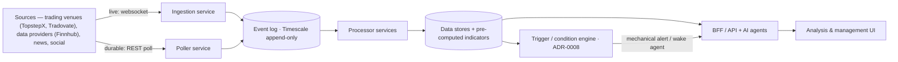
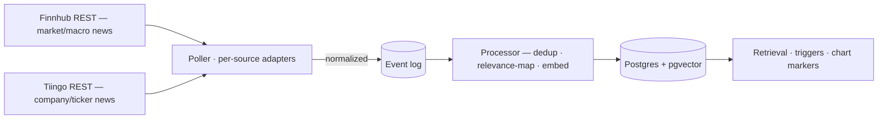

# Trading Co-Pilot — System Architecture

**Companion to:** [`trading-platform-prd.md`](trading-platform-prd.md) (product requirements — *what*) and
[`trading-platform-engineering.md`](trading-platform-engineering.md) (engineering practices — *how we build*).
**Status:** Draft / scaffold · **Date:** 2026-07-18

The **runtime view** — the services and how data flows between them. Early and deliberately lightweight: it
captures the intended shape and the open decisions, and deepens as design proceeds. Requirement IDs (`R-#`) link
to the PRD.

## Shape — independently-scalable services over an event pipeline

The platform is a set of **microservices and supporting components** joined by an **event pipeline (event
backbone)**, plus the analysis & management UI. Ingest is deliberately **thin**; a **processing tier** does the
work and persists. Every component **scales independently** to its own workload.

## Event backbone — append-only Timescale event log (ADR-0001)

The "event pipeline" above is an **append-only event log on TimescaleDB**, not a delete-on-consume queue — the
same hypertable is the **durable store *and* the replayable log**. Producers append; each consumer group tracks
its own **cursor**, so consumers are independent and a **new consumer can replay the whole history** to (re)build
derived data. `LISTEN/NOTIFY` wakes consumers on new events; `SKIP LOCKED` parallelizes workers within a
consumer. PGMQ is reserved for true *work queues* (do-once-and-discard tasks), not this log. Rationale,
alternatives (Kafka / NATS / Redis Streams), and consequences: [ADR-0001](adr/0001-event-backbone.md).

## Components

### Venue abstraction — the broker seam (R-17)
Everything below depends on venue-neutral interfaces, never on a broker SDK. They live in
`MarqSpec.TradingCopilot.Domain/Venue/`; each venue ships an adapter behind them (v1: ProjectX/TopstepX).

**Decomposed into three slices**, so a component depends on the narrowest one that does its job:

| Slice | Interface | Who implements it |
|---|---|---|
| Market data | `IMarketDataSource` — resolve contract, historical bars, quote stream | every source, **including data-only providers** (Finnhub) |
| Accounts | `IAccountSource` — discover accounts, read positions | trading venues; the risk layer (R-5) reads without execution rights |
| Execution | `IOrderExecutor` — place, cancel, **close position** | trading venues only |

`ITradingVenue` composes all three. A **data-only provider implements the market-data slice and nothing else** —
that's what makes "more than just futures data" (SPY/QQQ context) the same pipeline rather than a special case.

**Venue-tagged end-to-end.** `VenueId` plus `VenueAccountId` / `VenueContractId` (`venue:key`) — two venues can
each hand out account `9001`, and an `ESM25` on one is not the other's, so nothing is identified by a bare handle.

**Capabilities are explicit** (`VenueCapability` flags on each adapter; `Require(…)` throws
`VenueCapabilityNotSupportedException`). Venues really do differ — historical bars sit behind a paid tier on
Finnhub, order types vary — so a gap fails loudly at the seam instead of surfacing mid-execution (**Q-14**).

**What must not leak across it:** transport shape (ProjectX = one realtime host, two SignalR hubs; Tradovate =
two separate sockets), auth scheme, and how practice-vs-live is expressed (ProjectX exposes a required
**`simulated`** flag per account; Tradovate splits it by **host**). The adapter resolves it; the core sees only
`TradingMode`. `TradingModePolicy` then enforces **R-14 — practice accounts only outside production** — in code,
below the model.

### Risk gate — the enforcing checkpoint (R-5, R-16)
Every order funnels through one gate before transmission — manual ticket, taken suggestion, edited take, or a
conditional order firing. The LLM proposes; this decides. It lives in `MarqSpec.TradingCopilot.Domain/Risk/`,
deterministic and dependency-free, because a limit that can be talked around is not a limit (ADR-0007).

Size is the **most restrictive** of independently-sized layers, and the decision names the one that bound it:

| Layer | Budget | Measured at |
|---|---|---|
| `DrawdownFloor` | headroom to the trailing floor | safety stop |
| `DailyLossLimit` | the account's hard daily limit, where one exists | safety stop |
| `DailyGovernor` | the operator's personal governor, inside that limit | safety stop |
| `PerTradeRisk` | a fraction of **headroom** (not account size) | configurable: working or safety stop |
| `MaxDrawdownPerTrade` | the per-trade hard cap | safety stop |
| `ManualCap` | contract caps, overall and per instrument | — |
| `SanityCap` | contracts, notional, fat-finger band (R-16) | — |

**The worst case is the safety stop, not the working stop.** Hard account limits are measured against the
catastrophic exit, which bounds how wide that stop can sit and keeps the disaster case inside the account.

**Buying power is not the risk budget.** `TrailingDrawdown` models the floor that ends an account — end-of-day or
intraday trailing, a property of the *account* rather than the firm. Intraday floors follow the real-time peak
**including unrealized P&L**, so an open winner lifts the floor and giving it back can breach at an unchanged
realized balance.

Outcomes are `Allowed` / `Resized` / `Blocked`, always with a binding layer and a reason — including the gate's
"no trade" when the layers leave room for zero contracts.

### Ingestion service — live market data (R-1)
Connects via **websocket** and processes every event on the wire, then **publishes onto the event pipeline** for
uniform downstream handling. (ProjectX exposes this as SignalR hubs — see the wiki's
[ProjectX page](wiki/pages/projectx-gateway-api.md).) The same ingestion path serves **data-only providers**:
**Finnhub** streams **equities / indices** (SPY, QQQ, …) over a websocket (~50 symbols, free tier) as **cross-asset
context** for the traded futures (SPY ↔ ES, NASDAQ/QQQ ↔ NQ) — a market-data source with no account/execution
(the decomposed R-17 abstraction; engineering §3). Finnhub's **alternative data** rides the R-2 non-market template.

### Poller service(s) — durable data (R-1 historical, R-2 soft signals)
Polls REST endpoints on a configurable interval (R-1: default 60s). **Thin by design** — pollers only **poll,
normalize responses to a consistent schema, and publish the valid data to the event pipeline**; they do *not*
process it. One polling framework **fans out** across many sources, of the same kind or different — trading venues
(`TopstepX`, `Tradovate`), data-only providers (`Finnhub` — equities/indices quotes + alternative data; note historical candles are a paid tier), and
data kinds (market/trade data, news, social). This dovetails with the venue
abstraction (R-17) and the soft-signal sources (R-2), and keeps all processing uniform and in one place.

### Processor service(s) — process, persist, pre-compute (R-3, R-4, R-8/R-9)
Consumes a **data type** off the event pipeline, processes it, and writes to the data stores (Timescale /
pgvector / relational — engineering §2). Crucially, the processor **pre-computes indicator data** so indicators
are not recomputed on demand: the AI agents that generate suggestions and revise strategies (R-4) are weak at
numeric indicator computation, so **pre-computed indicators are both faster and higher-quality** inputs. Feeds
order-flow analytics (R-3) and the journal (R-8/R-9). Indicators are **projections over the append-only event log** (ADR-0001): those that fit are TimescaleDB continuous aggregates, the rest are replay consumers — so **adding or rebuilding an indicator is a new consumer replaying the log**, no re-ingest.

### News & soft-signal ingestion (R-2)
The **reference implementation** of the non-market template. Two REST sources (no free news websocket): **Tiingo**
(company / ticker-tagged, one call across the watchlist — the binding **50 req/hr** budget, so a **single
global-feed poll with local filter**, incremental via a `crawlDate` watermark) and **Finnhub** (market / macro
news; company-news is left off as redundant with Tiingo). Per-source **poller adapters** normalize to the common
**`SoftSignal`** model and publish to the event log. The **processor** then (1) **dedups across sources** — canonical
URL → fuzzy fallback on title + published-time window + ticker overlap; **one canonical record, both provenances,
before embedding**; (2) applies the **configurable relevance model** — `ticker↔instrument` maps + **per-instrument
& global topics**, AI-suggested and user-curated in a config panel (R-6/R-7); (3) **embeds** (Cohere → pgvector).
Stores serve suggestion/chat retrieval, the **trigger engine** (news as a condition — ADR-0008), and **chart event
markers** (R-10). **Deferred:** sentiment scoring — a subagent classifier and/or a user thumbs-up/down rating (R-9).

### Trigger / condition engine — deterministic scan, event-driven AI (R-4, R-7, ADR-0008)
The **continuous scanning** behind R-4 runs here — **not** in an LLM. This consumer evaluates **trigger conditions**
(compiled from the operator's rulebook, R-7) over the **pre-computed indicators**, order-flow, price, and account
state. It is CPU-cheap and scales to any tick rate; the LLM is never in this loop. On a fire it routes one of two
ways: a **mechanical** setup emits a **deterministic alert / suggestion** (no LLM); a **judgment** setup **wakes a
strategy agent** (the executor combines agents into a timely suggestion) — one LLM call per event, not per tick.
Cheaper-model triage, debounce / rate-limit, and an optional AI-spend governor keep cost bounded. Rationale and the
"LLM at the edges" model: [ADR-0008](adr/0008-ai-invocation-cost-model.md).

### Analysis & management UI
A **React SPA** — the operator's surface — consuming the BFF's **REST** endpoints and **SignalR** hubs
(websockets); the Internet-exposed frontend, **authenticated by JWT** (R-18; see *Authentication* below). It ships
as an **installable PWA** (manifest + service worker; Android primary, iOS best-effort) — a presentation client
only, so safety-critical enforcement stays server-side regardless of client state (R-19, [ADR-0010](adr/0010-progressive-web-app.md)).
**The chart is its central component:** a purpose-built candlestick chart (**Lightweight
Charts**, ADR-0004 — with RSI/MACD indicator subcharts in panes) onto which everything **overlays** — indicators incl. custom (pre-computed by the processor), price levels, suggestion
entry/stop/target zones, live positions / orders / fills, and the operator's own drawings (R-10). The order
ticket, journal, rulebook, and chat panels sit around it (R-6, R-11). A separate **order-flow / Depth-of-Market**
visual (Bookmap-style liquidity heatmap + trades) is a bespoke **canvas / WebGL** component — no candlestick
library provides it — fed by the depth/trade streams (R-3, R-1, ADR-0004); d3/canvas covers lighter bespoke
views (footprint, volume profile).

## Cross-cutting
- **Independent scaling.** A saturated ingestion socket, bursty pollers, and heavy processors each scale on their
  own.
- **Uniform processing.** Thin ingest → event pipeline → processors means live, historical, news, and social
  data — across every venue — are all handled the same way.
- **The safety-critical execution path is separate.** Order placement, execution-time re-validation, sanity
  caps, the kill switch, and auto-flatten (R-5 / R-11 / R-12 / R-13 / R-16) are their own path, not part of this
  ingest → process flow (engineering §9; [ADR-0007](adr/0007-order-execution-model.md)).
- **Authentication.** The REST API and real-time connections are the **Internet-exposed** surface and require a
  **JWT** on every request/connection (R-18). Authorization runs through a **claims / policy layer** that **scopes every request to the authenticated user** —
  the app is **multi-user**, each user's data isolated at the data layer (R-20, [ADR-0011](adr/0011-multi-user-tenancy.md));
  richer roles remain an incremental add ([ADR-0003](adr/0003-authentication.md)). Execution, kill-switch,
  and account endpoints sit behind this same gate — no unauthenticated path to order actions.

## Open decisions (spikes)
- **Event backbone — resolved:** an **append-only Timescale event log** ([ADR-0001](adr/0001-event-backbone.md)) — store + replayable log, consumers with cursors, indicators as projections. NATS JetStream is the documented upgrade path if we outgrow Postgres.
- **Service ↔ project mapping.** How these services map to the .NET project sketch (engineering §3) and to
  deployables.
- **Delivery guarantees.** What the analytics path needs vs. the (separate) execution path.

*Decisions are recorded as ADRs in [`adr/`](adr/) as design proceeds.*
