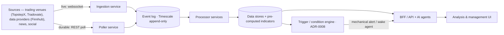
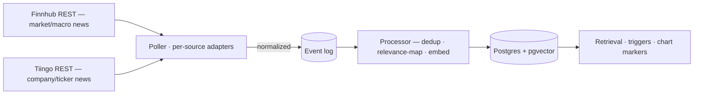

# Trading Co-Pilot — System Architecture

**Companion to:** [`trading-platform-prd.md`](trading-platform-prd.md) (product requirements — *what*) and
[`trading-platform-engineering.md`](trading-platform-engineering.md) (engineering practices — *how we build*).
**Status:** Living — the **execution & safety runtime is built** (see *The safety-critical runtime*) and the
**ingest/process tier has substantially landed**: market-data ingestion, bar/gap backfill, indicator projections,
and the news → dedup → relevance → embedding pipeline are all shipped (the component sections below carry per-service
*Implemented* markers). The idealized "Ingestion / Poller / Processor" split below is the intended shape; the shipped
services realize it as concrete hosts · **Date:** 2026-07-18, revised 2026-07-30 (gh#490)

The **runtime view** — the services and how data flows between them. Early and deliberately lightweight: it
captures the intended shape and the open decisions, and deepens as design proceeds. Requirement IDs (`R-#`) link
to the PRD.

## Shape — independently-scalable services over an event pipeline

The platform is a set of **microservices and supporting components** joined by an **event pipeline (event
backbone)**, plus the analysis & management UI. Ingest is deliberately **thin**; a **processing tier** does the
work and persists. Every component **scales independently** to its own workload.

## Event backbone — append-only Timescale event log (ADR-0001)

The "event pipeline" above is an **append-only event log on TimescaleDB**, not a delete-on-consume queue — the
same hypertable is the **durable store *and* the replayable log**. Producers append; each consumer group tracks
its own **cursor**, so consumers are independent and a **new consumer can replay the whole history** to (re)build
derived data. `LISTEN/NOTIFY` wakes consumers on new events; `SKIP LOCKED` parallelizes workers within a
consumer. PGMQ is reserved for true *work queues* (do-once-and-discard tasks), not this log. Rationale,
alternatives (Kafka / NATS / Redis Streams), and consequences: [ADR-0001](adr/0001-event-backbone.md).

## Components

### Venue abstraction — the broker seam (R-17)
Everything below depends on venue-neutral interfaces, never on a broker SDK. They live in
`MarqSpec.TradingCopilot.Domain/Venue/`; each venue ships an adapter behind them (v1: ProjectX/TopstepX).

**Decomposed into three slices**, so a component depends on the narrowest one that does its job:

| Slice | Interface | Who implements it |
|---|---|---|
| Market data | `IMarketDataSource` — resolve contract, historical bars, quote stream | every source, **including data-only providers** (Finnhub) |
| Accounts | `IAccountSource` — discover accounts, read positions | trading venues; the risk layer (R-5) reads without execution rights |
| Execution | `IOrderExecutor` — place, cancel, **close position** | trading venues only |

`ITradingVenue` composes all three. A **data-only provider implements the market-data slice and nothing else** —
that's what makes "more than just futures data" (SPY/QQQ context) the same pipeline rather than a special case.

**Venue-tagged end-to-end.** `VenueId` plus `VenueAccountId` / `VenueContractId` (`venue:key`) — two venues can
each hand out account `9001`, and an `ESM25` on one is not the other's, so nothing is identified by a bare handle.

**Capabilities are explicit** (`VenueCapability` flags on each adapter; `Require(…)` throws
`VenueCapabilityNotSupportedException`). Venues really do differ — historical bars sit behind a paid tier on
Finnhub, order types vary — so a gap fails loudly at the seam instead of surfacing mid-execution (**Q-14**). The
**ProjectX adapter** reaches `HistoricalBars`, `Quotes`, `ClosePosition`, `BracketOrders`, `AccountStreaming`
(order / position / fill events over the user hub, behind the singleton `IAccountEventStream` seam, parallel to
the `IVenueConnection` liveness seam — since **gh#219**), and — since **gh#259** — `ModifyOrder` (an in-place
reprice of a working order, behind `IOrderExecutor.ModifyOrderAsync`); `MarketDepth` and `TrailingStops` remain
**declared-but-unreached** by the neutral contract and stay unadvertised, so a caller never commits to a path that
cannot work.

**What must not leak across it:** transport shape (ProjectX = one realtime host, two SignalR hubs; Tradovate =
two separate sockets), auth scheme, and how the venue expresses its **execution mode** (ProjectX exposes a
required **`simulated`** flag per account; Tradovate splits it by **host**). The core sees only `TradingMode`,
and `TradingModePolicy` enforces **R-14** in code, below the model.

#### `TradingMode` is declared, not derived (R-14, gh#60)

A venue's mode flag says **where an order executes**, not **whether capital is at risk** — on a prop platform the
two are close to orthogonal. A Topstep *funded* account reports `simulated: true` (it is copy-traded on a
simulated matching engine) yet real payouts ride on it, and breaching it costs the operator money. The shipped
adapter originally mapped `simulated → Practice`; a run against a real login classified **all 293 accounts as
practice — `EXPRESS-…` funded stages included**, which R-14 would then have permitted trading outside
production. The gate failed in the dangerous direction.

So the derivation is gone. Three pieces replace it:

| Piece | Owns | Where |
| --- | --- | --- |
| `AccountStage` | Where an account sits in a programme — `Practice` · `Evaluation` · `Funded` · `Unknown` | reported by the venue |
| `FirmConventions` | What each stage **means economically** at one firm, declared by the operator | operator configuration |
| `TradingMode` | Whether capital is at risk — `Practice` · `Live` · **`Undeclared`** | resolved from the two above |

Conventions belong to the **firm**, not the platform: several firms share a platform, the operator holds one
login per firm, and they classify their stages differently. An **undeclared** stage resolves to
`TradingMode.Undeclared`, which `TradingModePolicy` refuses in **every** environment — production included, since
that is where guessing costs most. Silence is not consent: the failure mode is "classify this before trading it",
never "assumed practice, then traded a funded account". Both enums make the unsafe reading their zero value, so an
uninitialised mode fails closed rather than defaulting to something tradeable.

> **Seam closed (gh#76, PRs #86–#94):** the declaration now flows end-to-end — the operator declares stage
> conventions per firm (`/firms`, ADR-0016), discovery persists each account's resolved stage (with a per-account
> operator override), and `ProjectXVenueFactory` hands the venue real `FirmConventions`, so modes resolve from the
> declaration instead of a hard-coded `None`. An undeclared stage still reads `Undeclared` and stays untradeable —
> that part is the design, not a gap.

### Risk gate — the enforcing checkpoint (R-5, R-16)
Every order funnels through one gate before transmission — manual ticket, taken suggestion, edited take, or a
conditional order firing. The LLM proposes; this decides. It lives in `MarqSpec.TradingCopilot.Domain/Risk/`,
deterministic and dependency-free, because a limit that can be talked around is not a limit (ADR-0007).

Size is the **most restrictive** of independently-sized layers, and the decision names the one that bound it:

| Layer | Budget | Measured at |
|---|---|---|
| `DrawdownFloor` | headroom to the trailing floor | safety stop |
| `DailyLossLimit` | the account's hard daily limit, where one exists | safety stop |
| `DailyGovernor` | the operator's personal governor, inside that limit | safety stop |
| `PerTradeRisk` | a fraction of **headroom** (not account size) | configurable: working or safety stop |
| `MaxDrawdownPerTrade` | the per-trade hard cap | safety stop |
| `ManualCap` | contract caps, overall and per instrument | — |
| `SanityCap` | contracts, notional, fat-finger band (R-16) | — |

**The worst case is the safety stop, not the working stop.** Hard account limits are measured against the
catastrophic exit, which bounds how wide that stop can sit and keeps the disaster case inside the account.

**Buying power is not the risk budget.** `TrailingDrawdown` models the floor that ends an account — end-of-day or
intraday trailing, a property of the *account* rather than the firm. Intraday floors follow the real-time peak
**including unrealized P&L**, so an open winner lifts the floor and giving it back can breach at an unchanged
realized balance.

Outcomes are `Allowed` / `Resized` / `Blocked`, always with a binding layer and a reason — including the gate's
"no trade" when the layers leave room for zero contracts.

### Gated send path — one way to a broker (R-11, R-14)

`OrderExecutionService` (`Domain/Execution/`) is the **only** thing that reaches an executor. Manual tickets,
taken suggestions and edited takes all funnel through it, so the guards cannot be routed around (ADR-0007). The
size transmitted is always the one the **gate approved**, never the one asked for — sending the requested
quantity after a resize would make the gate advisory.

Guards run in a deliberate order, and each refusal is a distinct outcome rather than an exception:

| Order | Guard | Outcome on refusal |
| --- | --- | --- |
| 1 | **R-14 environment** — may this account's mode be traded from this environment? | `RefusedByMode` |
| 2 | **Account state** — does the venue itself report the account as tradable? | `RefusedByAccountState` |
| 3 | **Coherence** — does the request describe one trade, at this venue? | `RefusedByMismatch` |
| 4 | **Representability** — can the ticket express this order type? | `RefusedByUnsupportedType` |
| 5 | **Risk gate** — blocked, or resized to nothing | `RefusedByRisk` |

Everything before the gate runs *first* on purpose: an authorization computed from an incoherent request would
not describe what gets sent. Every pre-gate refusal carries **no** `GateDecision` — nothing was sized — so
consumers read the outcome rather than inferring a reason from a null decision.

**Guards are whitelists, not blacklists.** The order-type check names the four types the ticket can express, and
the gate check names the two outcomes that constitute authorization (`Allowed`, `Resized`) — everything else is
refused. A value arriving from deserialization or a cast, or an enum member added later without revisiting this
path, cannot fall through into a transmitted order. A new order type or gate outcome opts in here deliberately.

**R-14 has two obligations, and this path discharges one.** The *environment restriction* — practice accounts
only outside production — is enforced here, in code, below the model. The *mode guard* is a different rule: an
`Order` or `Suggestion` may not be **persisted** with a mode conflicting with its parent `Account.mode`. That is
journal integrity rather than transmission safety, and it belongs to the data layer — the venue ticket carries no
mode. **Both halves are now live** (gh#7, gh#11): every *sized* attempt persists a `GateDecision` (a pre-gate
refusal persists nothing — it was never sized), a placed order journals its `Order` linked to that decision, and
the mode guard is enforced at the repository **and** by a DB constraint trigger (`enforce_mode_matches_account`)
plus a mode ≠ `undeclared` CHECK. The data dictionary §4 catalogues the columns.

**The kill switch sits above every guard.** `OrderExecutionService` reads an `IKillSwitch` and, while engaged,
refuses every transmission as `RefusedByKillSwitch` **before the order is sized** (gh#189). Reducing actions —
auto-flatten's close, stop promotion — do not route through this path, so the lock stops new risk without
stranding open positions.

**Two pairings are enforced rather than assumed**, because nothing structural forces them and both fail in the
same direction — the gate authorizes one thing, the venue receives another:

- **Account.** `RiskContext` carries the `VenueAccountId` it describes. Equity, drawdown floor and daily limits
  are account-specific, so sizing against one account and transmitting to another approves a quantity the target
  account never justified.
- **Instrument.** `ResolveContractAsync` returns a `ResolvedContract` — the venue's opaque handle **paired with
  the instrument it was resolved for** — so an `ES`-sized proposal cannot be sent as an `NQ` contract. The venue
  that performed the lookup is the only party that knows the pairing, so that is where it is established.
- **Venue.** The account and contract must both be tagged for the executor's own venue. Handles collide freely
  across brokers — a bare `9001` is a different account at every one — and relying on each adapter to notice
  means an adapter exception rather than a refusal, from adapters that happen to check.

**The environment is fixed at construction**, from trusted host configuration, never passed per send. R-14 is an
enforcement boundary; a caller able to name its own environment could walk a live account through it from a
development host.

`TrailingStop` is **refused outright**: the neutral ticket carries no trail distance, so no venue could receive it
correctly. That is a property of the request, not of any venue's capabilities — refusing it here makes the answer
the same whichever adapter is wired in. Trail distance arrives with staged stops.

### The safety-critical runtime — the hosted services that act unattended (R-11, R-13, ADR-0007, ADR-0013)

Everything above is *request*-driven: an operator asks, the gate answers. The services below are **not** — they
run on a timer or on the event log, unattended, and several of them place orders. That is why they are the
highest-rigor part of the system (engineering §9) and why they are listed here rather than folded into the
ingest → process flow, which they deliberately sit outside of.

| Host (`Api/`) | Cadence | What it does | Why it exists |
|---|---|---|---|
| `MarketDataIngestionHost` | supervised subscription | normalises the venue quote stream into the event log as `market.quote` (gh#13) | the backbone's only producer today |
| `StopPromotionHost` | event log · `stop-promotion` cursor | promotes a **hidden** working stop to a native order once price enters its band (gh#153) | a hidden stop is only safe if something is watching for it to matter |
| `ConditionalOrderHost` | event log · `conditional-order` cursor | fires / cancels / expires pending conditional entries, each through the **authoritative fire-time re-gate** (gh#198) | "send when conditions met" must be re-judged at fire, not at arm (R-12) |
| `VenueConnectionMonitorHost` | poll over `IVenueConnection` | orphans every hidden stop on a venue **drop**, re-arms on reconnect (gh#209) | a synthetic stop cannot promote without quotes; the native safety stop stays the floor |
| `AutoFlattenHost` | timer · DST-aware `MarketClock` | the **primary** R-13 trigger — closes positions at each instrument's per-market deadline, verifies flat, journals `flatten.*` (gh#185) | the one autonomous action, and it only reduces exposure |
| `AutoFlattenWatchdogHost` | **separate** timer, own loop | the **redundant second tier** — backstops the primary past a grace window, persists on a rejected close, escalates to critical rather than firing blind (gh#187) | ADR-0013's independence requirement: a bug in the primary must not disable the flatten |
| `DeadMansSwitchHost` | timer · per-instrument check-in | the **third** R-13 tier — reports each flat market to an **external** monitor and *withholds* the check-in while exposure remains past the deadline (gh#244) | the worst R-13 failure is the host dying and taking its own alerting with it, so here **silence is the alarm** (ADR-0019) |
| `AccountEventStreamHost` | supervised venue stream | ingests fills / order-state events — writes `Fill` rows, advances orders to `PartiallyFilled`/`Filled`, drives OCO-cancel-on-exit (gh#219), and **journals the closed round trip to `Trade`** on a flat, with a signed tick-value-aware `RealizedPnL` (gh#731) | protection must retire off **venue truth**, not off what the app believes it sent; the same venue-truth fills are what the round trip is reconstructed from |
| `ProtectionMonitorHost` | timer · census | sweeps for a live position with **no** protective stop resting at the venue and pages P1 (gh#370) | the ADR-0019 unprotected-position census — the one state no other guard is watching *for* |
| `TriggerScanHost` | timer · indicator cadence | evaluates confirmed, enabled triggers and fires the crossing edges — mechanical alert or agent review (gh#385, gh#402) | R-4's "continuous scanning", deterministic and with no LLM in the loop (ADR-0008) |

*(Ingest and notification-delivery hosts — bar/gap backfill, indicator projection, news ingest/relevance/embedding,
the notification pump and outbox relay — run unattended too but are not execution paths; they belong to the
ingest → process flow above and to ADR-0019's delivery chain.)*

Two more run once, at startup, in the same scope as migrate + bootstrap:

- **`KillSwitch` rehydration** (gh#189) — the persisted `KillSwitchState` row is read back into the process-wide
  flag, so the operator's lock **survives a restart**; nothing silently re-enables trading.
- **`DecisionStateRehydrator`** (gh#221) — reads the whole decision surface back **inertly** (staged orders,
  pending conditionals, hidden stops, active suggestions) and resumes *none* of it; on an **impossible
  cross-entity combination** a crash left, it engages the kill switch (`HaltOnly`) and alerts, **never repairing**.
  It reads across owners as background plumbing yet carries ownership on every row (R-20).

`PositionReconciliationService` backs `GET /accounts/{id}/positions` (gh#193): positions come from **venue truth**
tagged `Live` / `Settlement` (a re-mark inside the maintenance window, derived per-instrument from `MarketSession`)
/ `Unknown` when the venue cannot be reached — declared-unknown, never a stale live view. The whole model is
consolidated in [ADR-0013](adr/0013-failure-recovery-model.md).

**The pattern these share.** Every *polling* host opens a **fresh DI scope per pass** and exits cleanly on
teardown — a scope held across passes cascades `ObjectDisposedException` through the parallel suites, and a host
that ignores its stop token outlives the app. (`MarketDataIngestionHost` is the exception that proves it: its
scope spans the *subscription*, because a websocket subscription is the unit of work, not a poll.) Each reads
across the R-20 filter with `IgnoreQueryFilters` to **discover** work — background plumbing has no request user —
but does each owner's work in a context **scoped to that owner**, so the request-path guards stay correct
unchanged rather than being re-implemented (the gh#148 duplication lesson). And every state transition is
**one-way and idempotent**, which is what makes at-least-once redelivery safe on restart: a resolved conditional
never re-fires, an already-`Native` stop is skipped, and a cursor commits per batch.

### Ingestion service — live market data (R-1)
Connects via **websocket** and processes every event on the wire, then **publishes onto the event pipeline** for
uniform downstream handling. (ProjectX exposes this as SignalR hubs — see the wiki's
[ProjectX page](wiki/pages/projectx-gateway-api.md).) The same ingestion path serves **data-only providers**:
**Finnhub** is *intended* to stream **equities / indices** (SPY, QQQ, …) over a websocket (~50 symbols, free tier) as
**cross-asset context** for the traded futures (SPY ↔ ES, NASDAQ/QQQ ↔ NQ) — a market-data source with no account/execution
(the decomposed R-17 abstraction; engineering §3). Finnhub's **alternative data** rides the R-2 non-market template.
**Implemented:** `MarketDataIngestionHost` (+ `IngestionOptions`, the `Ingestion:Symbols` allowlist) publishes market
data onto the event backbone — today fed by **ProjectX**, the only `IMarketDataSource` that exists.
**Built, but on the *context* seam:** `FinnhubMarketDataSource` implements **`IContextMarketDataSource`** — not
`IMarketDataSource` — and is registered in `Program.cs`, so the cross-asset context surface described above is live;
`Integration.Finnhub` holds it alongside the **news** source (gh#439). That distinction is what keeps the sentence
above true: a *context* source feeds SPY/QQQ alongside the traded future, while an `IMarketDataSource` is a
**tradable** quote feed, and ProjectX is still the only one of those. **Still not built:** Finnhub as an
`IMarketDataSource` — tracked by gh#411 (client gh#495, adapter gh#496).

### Poller service(s) — durable data (R-1 historical, R-2 soft signals)
Polls REST endpoints on a configurable interval (R-1: default 60s). **Thin by design** — pollers only **poll,
normalize responses to a consistent schema, and publish the valid data to the event pipeline**; they do *not*
process it. One polling framework **fans out** across many sources, of the same kind or different — trading venues
(`TopstepX`, `Tradovate`), data-only providers (`Finnhub` — equities/indices quotes + alternative data; note historical candles are a paid tier), and
data kinds (market/trade data, news, social). This dovetails with the venue
abstraction (R-17) and the soft-signal sources (R-2), and keeps all processing uniform and in one place.
**Implemented:** `BarBackfillService`/`BarBackfillHost` and `GapBackfillService` durably fill the bar store, and
`BarStoreHealService` heals it on restart (gh#696): one session-aware heal pass — `BarGapDetector` over
`BarSessionCalendar` — runs before the poll loop, backfilling interior holes from retained venue history; the
news pollers land as `NewsIngestionService`/`NewsIngestionHost` (see *News & soft-signal ingestion* below).

### Processor service(s) — process, persist, pre-compute (R-3, R-4, R-8/R-9, R-22)
Consumes a **data type** off the event pipeline, processes it, and writes to the data stores (Timescale /
pgvector / relational — engineering §2). Crucially, the processor **pre-computes indicator data** so indicators
are not recomputed on demand: the AI agents that generate suggestions and revise strategies (R-4) are weak at
numeric indicator computation, so **pre-computed indicators are both faster and higher-quality** inputs. Feeds
order-flow analytics (R-3) and the journal (R-8/R-9). Indicators (R-22) are **projections over the append-only event log** (ADR-0001): those that fit are TimescaleDB continuous aggregates, the rest are replay consumers — so **adding or rebuilding an indicator is a new consumer replaying the log**, no re-ingest.
**Implemented:** `IndicatorProjectionService`/`IndicatorProjectionHost` over the `IndicatorSet` (ATR, RSI — gh#310/#372), read back through `StoredIndicatorSource : IIndicatorSource`.

### News & soft-signal ingestion (R-2)
The **reference implementation** of the non-market template. Two REST sources (no free news websocket): **Tiingo**
(company / ticker-tagged, one call across the watchlist — the binding **50 req/hr** budget, so a **single
global-feed poll with local filter**, incremental via a `crawlDate` watermark) and **Finnhub** (market / macro
news; company-news is left off as redundant with Tiingo). Per-source **poller adapters** normalize to the common
**`SoftSignal`** model and publish to the event log. The **processor** then (1) **dedups across sources** — canonical
URL → fuzzy fallback on title + published-time window + ticker overlap; **one canonical record, both provenances,
before embedding**; (2) applies the **configurable relevance model** — `ticker↔instrument` maps + **per-instrument
& global topics**, AI-suggested and user-curated in a config panel (R-6/R-7); (3) **embeds** (Cohere → pgvector).
Stores serve suggestion/chat retrieval, the **trigger engine** (news as a condition — ADR-0008), and **chart event
markers** (R-10). **Implemented:** the Tiingo + Finnhub news adapters (gh#439/#440), `NewsIngestionService`, the
cross-source dedup + relevance routing + Cohere embedding pipeline (gh#360/#361/#362), and the news-salience soft
signal (gh#27's first slice). **Deferred:** sentiment scoring — a subagent classifier and/or a user thumbs-up/down rating (R-9).

### Trigger / condition engine — deterministic scan, event-driven AI (R-4, R-7, ADR-0008)
The **continuous scanning** behind R-4 runs here — **not** in an LLM. This consumer evaluates **trigger conditions**
(compiled from the operator's rulebook, R-7) over the **pre-computed indicators**, order-flow, price, and account
state. It is CPU-cheap and scales to any tick rate; the LLM is never in this loop. On a fire it routes one of two
ways: a **mechanical** setup emits a **deterministic alert / suggestion** (no LLM); a **judgment** setup **wakes a
strategy agent** (the executor combines agents into a timely suggestion) — one LLM call per event, not per tick.
Cheaper-model triage, debounce / rate-limit, and an optional AI-spend governor keep cost bounded. Rationale and the
"LLM at the edges" model: [ADR-0008](adr/0008-ai-invocation-cost-model.md).
**Implemented — and now the most-built subsystem here.** `TriggerScanHost` + `TriggerEvaluationService` run the scan;
the **mechanical** route fires edge-debounced alerts with no LLM (gh#385) and the **agent-review** route wakes the
reviewer behind `ILlmProvider` (gh#402), served by the real `AnthropicLlmProvider` once a key is present (gh#423).
A cheap **triage** tier escalates genuinely-hard setups to a **deep** tier (gh#449), which receives bounded numeric
market context (gh#476). Spend is ledgered per call (gh#431) and metered (gh#477). The **AI-spend governor is no
longer optional** — `AiSpendGovernor` is registered unconditionally and gates the route pass-level (gh#448), with a
**budget-aware escalation skip** so a deep call is only made when it still fits (gh#478). A trigger is inert until the
operator **confirms** it (gh#470), and a dependency outage is visible rather than silent (`UnmeasurableSince`, gh#469).
**The operator can now act on what it proposes** (gh#547): `POST /suggestions/{id}/pass` records a **neutral pass** —
the first `SuggestionDisposition`, and the input the R-9 learning loop reads — so a suggestion's life no longer ends
at issuance. A passed setup drops off the default actionable surface while staying in the journal by id; disposition
kind is an **operator act** (`taken` / `modified` / `passed`), kept separate from the clock-driven lifecycle state
(gh#539). **The take path arms an order from a suggestion** (gh#548): `POST /suggestions/{id}/take` re-validates it is
still takeable *now* — `Active`, in-window (clock re-read via the same `SuggestionLifecycle.Decide` the sweep uses),
un-dispositioned, spec-resolvable, and **un-drifted** (price re-measured against the entry tolerance, not the
eventually-consistent state flag) — then stages an **editable ticket** through the order gate ladder **minus
transmission**, taking the **size from the suggestion** and stamping `Order.SuggestionId`; the gate is untouched and
still resizes/blocks, and sending stays the separate gated endpoint. Its `taken` / `modified` **disposition** writing
is part B (gh#549).

### Analysis & management UI
A **React SPA** — the operator's surface — consuming the BFF's **REST** endpoints and **SignalR** hubs
(websockets — the hub is authenticated, **presentation-only**, with idempotent resume: [ADR-0021](adr/0021-realtime-hub-contract.md), gh#645); the Internet-exposed frontend, **authenticated by JWT** (R-18; see *Authentication* below). It ships
as an **installable PWA** — a presentation client only (R-19, [ADR-0010](adr/0010-progressive-web-app.md), which
owns the packaging and the platform caveats).
**The chart is its central component:** a purpose-built candlestick chart (**Lightweight
Charts**, ADR-0004 — with RSI/MACD indicator subcharts in panes) onto which everything **overlays** — indicators incl. custom (pre-computed by the processor), price levels, suggestion
entry/stop/target zones, and live positions / orders / fills. **Drawing tools are out of scope** (ADR-0004). The
candlestick base is built (gh#725, Lightweight Charts) on the workspace, beside the suggestion panel (gh#654); its
underlying data reaches the client over HTTP (gh#644): `/api/marketdata/bars`, `/indicators` and `/levels` serve
OHLCV, the **pre-computed** indicator series (R-22's single number, never re-derived in the browser) and the active
price levels — authenticated (R-18), bounded, and global (not operator-owned). The **indicator panes** are built
(gh#726 — RSI / ATR, each in its own pane below the candles, toggled by the operator), with **price-level overlays**
(gh#727 — active support / resistance, toggled), **suggestion-zone overlays** (gh#727 — an active suggestion's entry /
stop / target, owner-scoped, stale-labelled on a dropped socket) and **execution overlays** (gh#727 — the operator's
live working orders + net position from the instrument-scoped venue-truth reads, gh#772, refreshed on each order / fill
push and honest-state-labelled — stale off the socket, unavailable when the venue-truth read is `Unknown`) and
**fill markers** (gh#727 — the operator's recent fills as buy / sell arrows on the candle series, from the gh#792
instrument-scoped **journal read** `GET /accounts/{id}/fills` over a fixed recent window, owner-scoped, refreshed on
each fill push and honest-state-labelled) rendering over a reusable overlay contract of two primitives — a price line
and a marker; the gh#727 chart-overlay family is complete. The **realtime** half is a single
JWT-authenticated SignalR connection (gh#649, [ADR-0021](adr/0021-realtime-hub-contract.md)): it resumes from its
last-applied `sequence` on reconnect and dedupes by that cursor, so a drop-and-reconnect is gap-free and
double-free, and its connection state is **always visible** — a degraded socket is shown degraded, never rendered
as a live view (R-19, [ADR-0013](adr/0013-failure-recovery-model.md)). The order
ticket, journal, rulebook, and chat panels sit around it (R-6, R-11). A separate **order-flow / Depth-of-Market**
visual sits beside it, fed by the depth/trade streams (R-3, R-1) — *why it is bespoke rather than a library, and
what renders it, are [ADR-0004](adr/0004-charting.md)'s.*

## Cross-cutting
- **Independent scaling.** A saturated ingestion socket, bursty pollers, and heavy processors each scale on their
  own.
- **Uniform processing.** Thin ingest → event pipeline → processors means live, historical, news, and social
  data — across every venue — are all handled the same way.
- **The safety-critical execution path is separate.** Order placement, execution-time re-validation, sanity
  caps, the kill switch, and auto-flatten (R-5 / R-11 / R-12 / R-13 / R-16) are their own path, not part of this
  ingest → process flow (engineering §9; [ADR-0007](adr/0007-order-execution-model.md)).
- **Authentication.** The REST API and real-time connections are the **Internet-exposed** surface and require a
  **JWT** on every request/connection (R-18). Authorization runs through a **claims / policy layer** that **scopes every request to the authenticated user** —
  data is scoped at the data layer by default-deny filters — a fail-closed safety property, not tenancy (R-20, [ADR-0017](adr/0017-single-operator-data-isolation.md));
  richer roles remain an incremental add ([ADR-0003](adr/0003-authentication.md)). Execution, kill-switch,
  and account endpoints sit behind this same gate — no unauthenticated path to order actions. The **realtime hub**
  authorizes on the **connection**: a WebSocket carries the JWT on the `access_token` query string (lifted for the
  hub path only), scoped once at connect for the socket's life, and the hub is **presentation-only** — never a path
  to an action ([ADR-0021](adr/0021-realtime-hub-contract.md), gh#645).

## Open decisions (spikes)
- **Event backbone — resolved:** an **append-only Timescale event log** ([ADR-0001](adr/0001-event-backbone.md)) — store + replayable log, consumers with cursors, indicators as projections. NATS JetStream is the documented upgrade path if we outgrow Postgres.
- **Service ↔ project mapping.** How these services map to the .NET project sketch (engineering §3) and to
  deployables.
- **Delivery guarantees.** What the analytics path needs vs. the (separate) execution path.

*Decisions are recorded as ADRs in [`adr/`](adr/) as design proceeds.*
